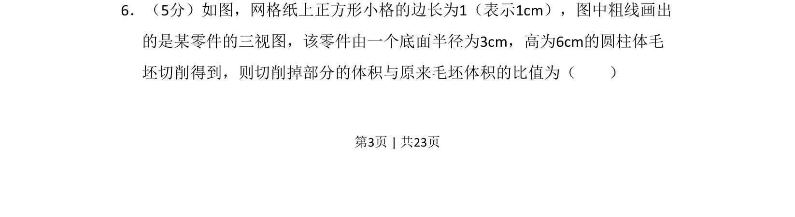
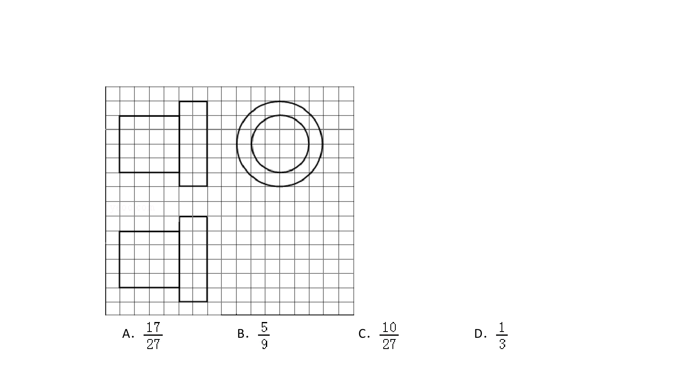
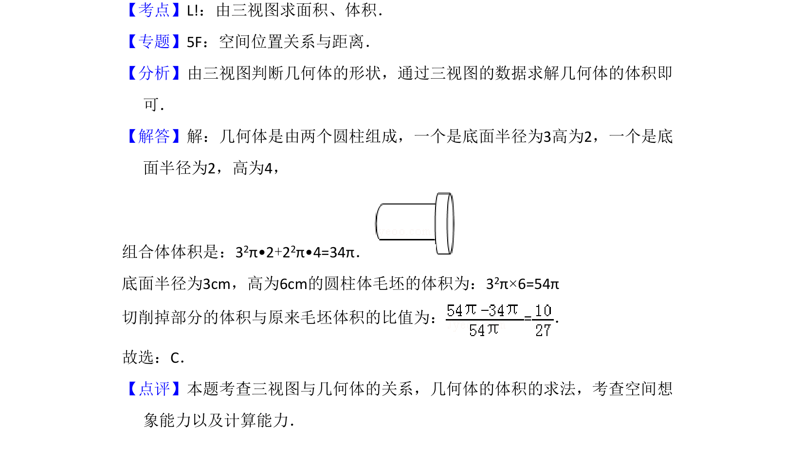

## 题面

## 摘要

根据三视图还原零件，计算切削掉部分与圆柱毛坯的体积比。

## 关联考点

- [[235-三视图|三视图]]
- [[652-体积计算|体积计算]]
- [[776-圆柱体积|圆柱体积]]
- [[1203-组合体|组合体]]

## 答案与解析

> 📄 原 PDF 第 3 页：`素材/真题/吉林/2008-2024·（吉林）数学高考真题/2014年高考数学试卷（理）（新课标Ⅱ）（解析卷）.pdf`
