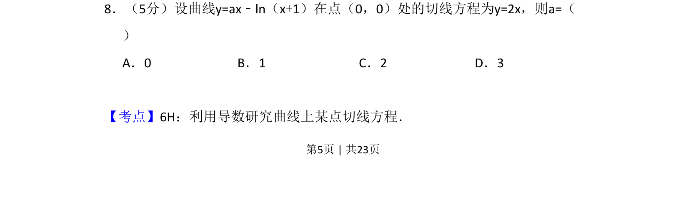
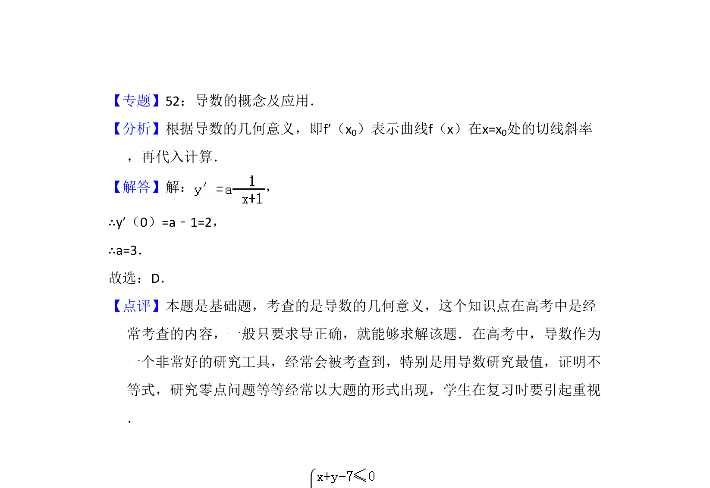

## 题面

## 摘要

本题考查利用导数求曲线切线方程，并通过已知切线斜率解出参数值。

## 关联考点

- [[425-反函数导数|导数]]
- [[422-切线方程|切线方程]]
- [[725-参数求解|参数求解]]

## 答案与解析

> 📄 原 PDF 第 5 页：`素材/真题/吉林/2008-2024·（吉林）数学高考真题/2014年高考数学试卷（理）（新课标Ⅱ）（解析卷）.pdf`

<!-- 题干文本-start -->
## 题干文本
8．（5分）设曲线y=ax﹣ln（x+1）在点（0，0）处的切线方程为y=2x，则a=（　　
）
A．0 B．1 C．2 D．3
<!-- 题干文本-end -->

<!-- 解析文本-start -->
## 解析文本
【考点】6H：利用导数研究曲线上某点切线方程．菁优网版权所有
<!-- 解析文本-end -->
