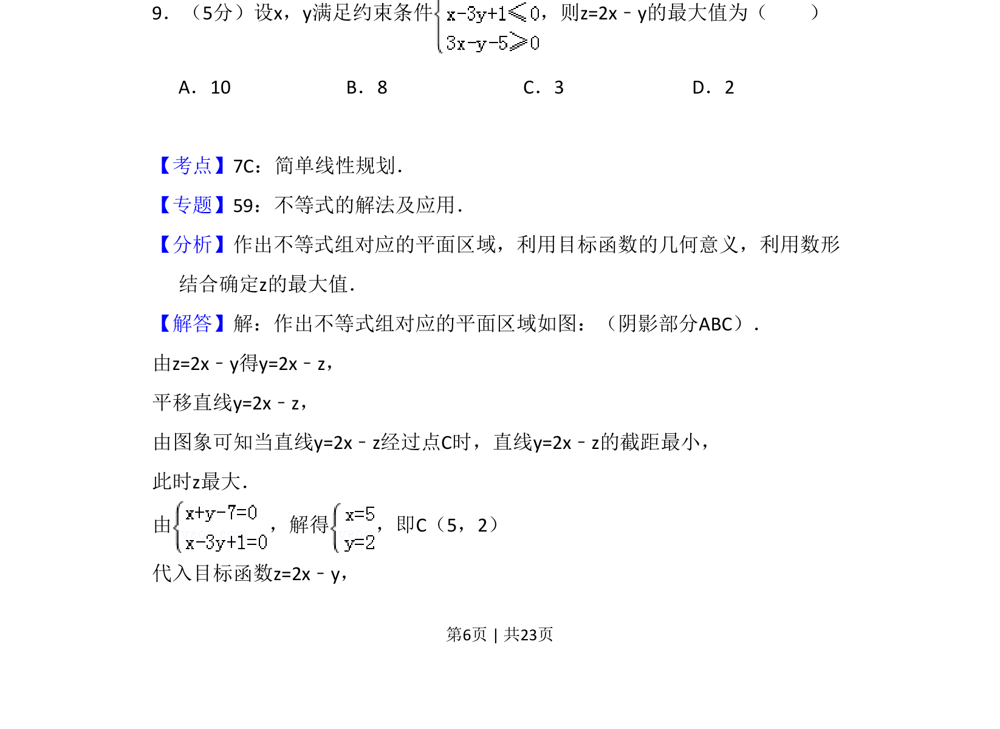
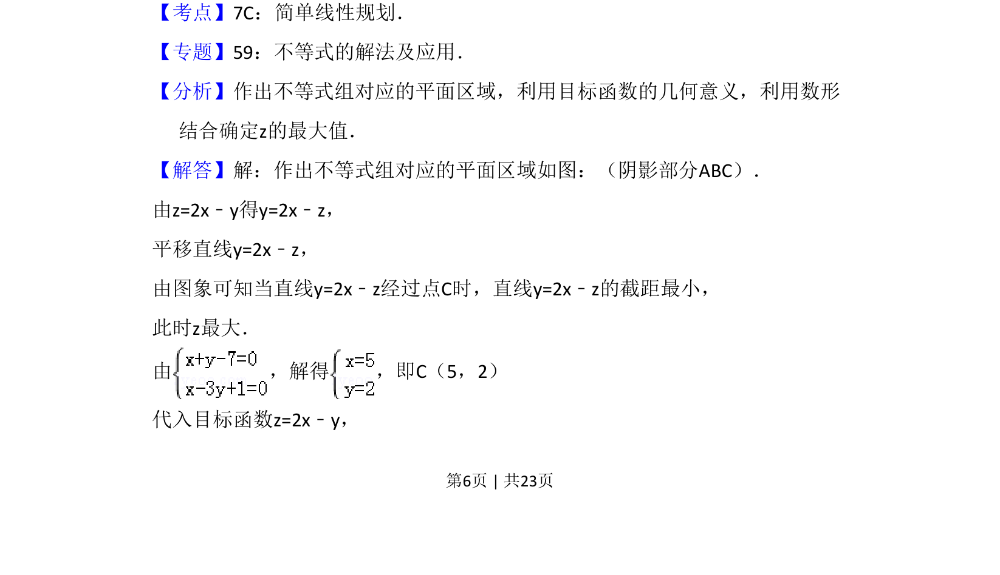
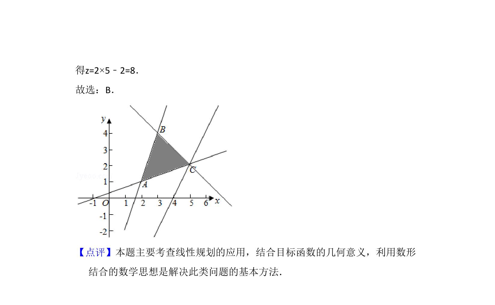

## 题面

## 摘要

本题主要考查利用线性规划求目标函数的最大值，需要画出可行域并平移直线。

## 关联考点

- [[1074-简单线性规划|简单线性规划]]
- [[897-数形结合|数形结合]]
- [[1000-目标函数最值|目标函数最值]]

## 答案与解析

> 📄 原 PDF 第 6 页：`素材/真题/吉林/2008-2024·（吉林）数学高考真题/2014年高考数学试卷（理）（新课标Ⅱ）（解析卷）.pdf`

<!-- 题干文本-start -->
## 题干文本
9．（5分）设x，y满足约束条件 ，则z=2x﹣y的最大值为（　　）
A．10 B．8 C．3 D．2
<!-- 题干文本-end -->

<!-- 解析文本-start -->
## 解析文本
【考点】7C：简单线性规划．菁优网版权所有
【专题】59：不等式的解法及应用．
【分析】作出不等式组对应的平面区域，利用目标函数的几何意义，利用数形
结合确定z的最大值．
【解答】解：作出不等式组对应的平面区域如图：（阴影部分ABC）．
由z=2x﹣y得y=2x﹣z，
平移直线y=2x﹣z，
由图象可知当直线y=2x﹣z经过点C时，直线y=2x﹣z的截距最小，
此时z最大．
由 ，解得 ，即C（5，2）
代入目标函数z=2x﹣y，
<!-- 解析文本-end -->
