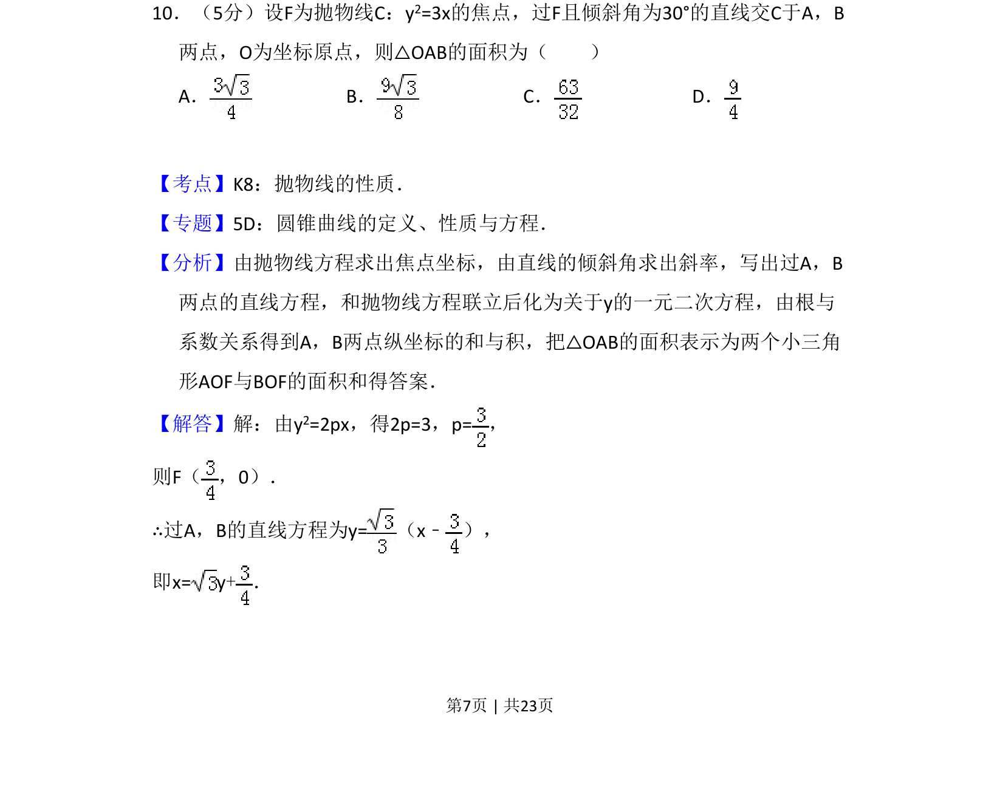
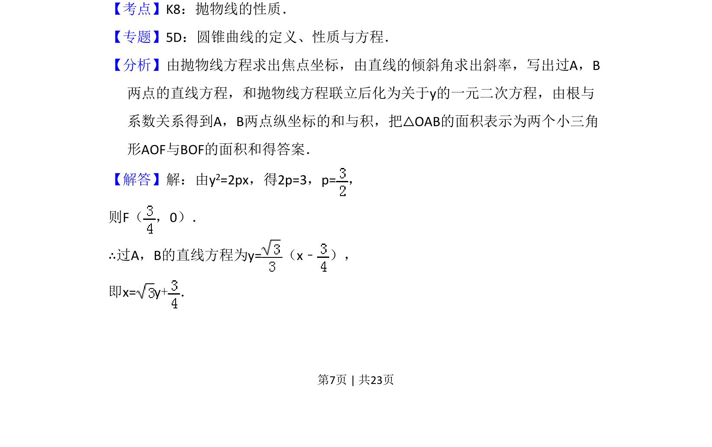
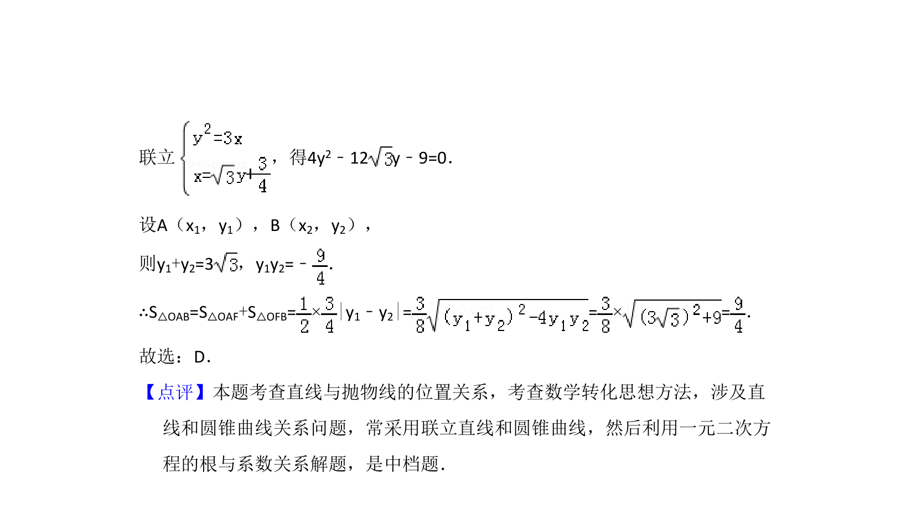

## 题面

## 摘要

抛物线焦点弦与原点构成的三角形面积计算

## 关联考点

- [[879-抛物线的性质|抛物线的性质]]
- [[380-抛物线焦点弦|焦点弦]]
- [[062-多边形面积|三角形面积]]
- [[234-韦达定理-初中|韦达定理]]

## 答案与解析

> 📄 原 PDF 第 7 页：`素材/真题/吉林/2008-2024·（吉林）数学高考真题/2014年高考数学试卷（理）（新课标Ⅱ）（解析卷）.pdf`
