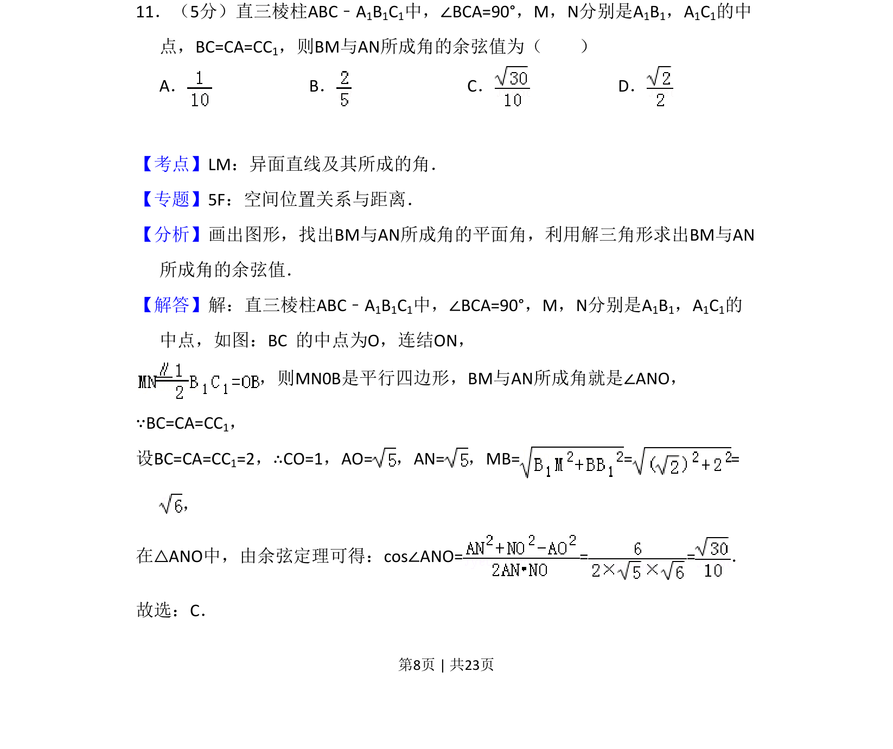
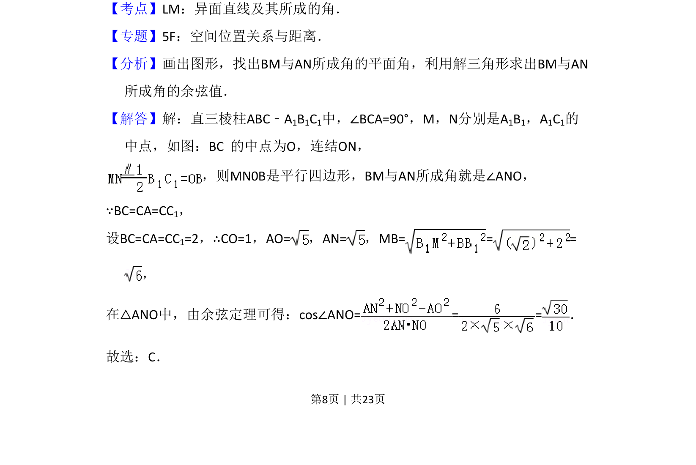
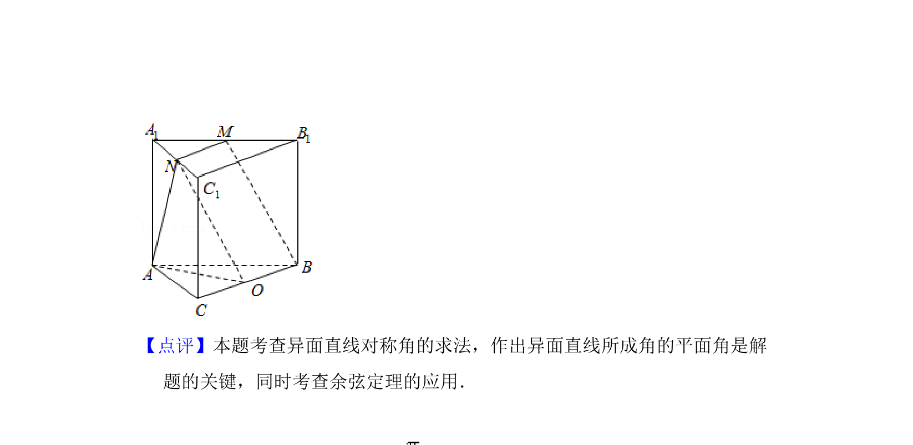

## 题面

## 摘要

直三棱柱中通过平移构造异面直线所成角，利用余弦定理求其余弦值。

## 关联考点

- [[862-异面直线及其所成的角|异面直线及其所成的角]]
- [[126-定理|余弦定理]]
- [[1050-空间向量与立体几何|空间向量与立体几何]]

## 答案与解析

> 📄 原 PDF 第 8 页：`素材/真题/吉林/2008-2024·（吉林）数学高考真题/2014年高考数学试卷（理）（新课标Ⅱ）（解析卷）.pdf`
