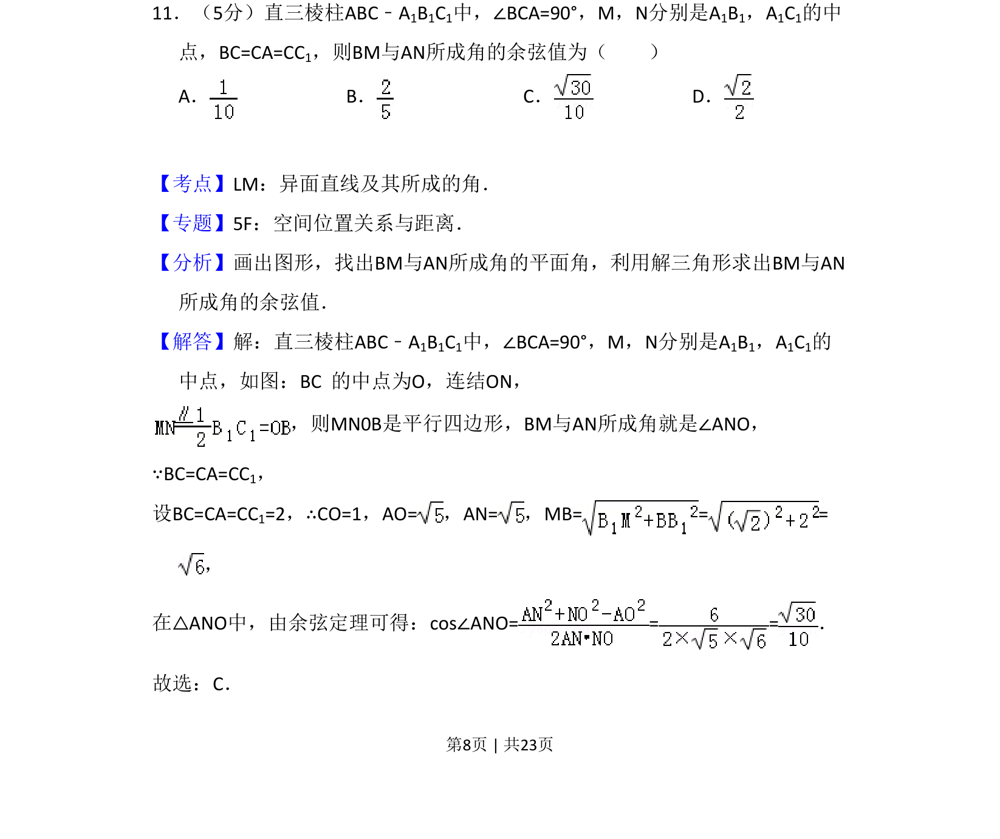
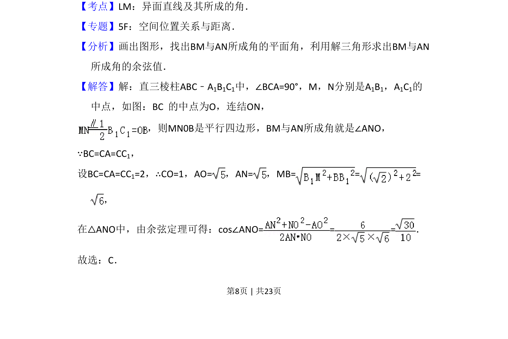
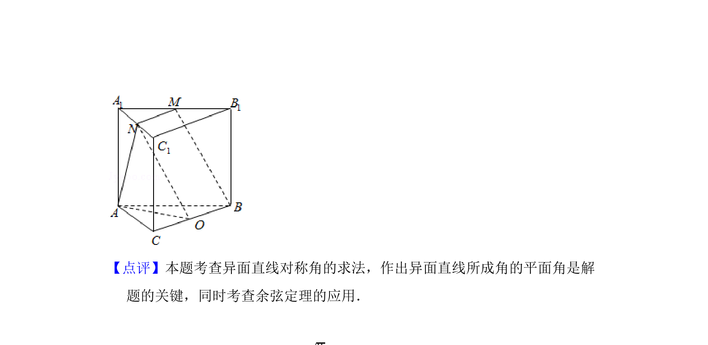

## 题面

## 摘要

直三棱柱中通过平移构造异面直线所成角，利用余弦定理求其余弦值。

## 关联考点

- [[862-异面直线及其所成的角|异面直线及其所成的角]]
- [[126-定理|余弦定理]]
- [[1050-空间向量与立体几何|空间向量与立体几何]]

## 答案与解析

> 📄 原 PDF 第 8 页：`素材/真题/吉林/2008-2024·（吉林）数学高考真题/2014年高考数学试卷（理）（新课标Ⅱ）（解析卷）.pdf`

<!-- 题干文本-start -->
## 题干文本
11．（5分）直三棱柱ABC﹣A1B1C1中，∠BCA=90°，M，N分别是A1B1，A1C1的中
点，BC=CA=CC1，则BM与AN所成角的余弦值为（　　）
A．B．C．D．
<!-- 题干文本-end -->

<!-- 解析文本-start -->
## 解析文本
【考点】LM：异面直线及其所成的角．菁优网版权所有
【专题】5F：空间位置关系与距离．
【分析】画出图形，找出BM与AN所成角的平面角，利用解三角形求出BM与AN
所成角的余弦值．
【解答】解：直三棱柱ABC﹣A1B1C1中，∠BCA=90°，M，N分别是A1B1，A1C1的
中点，如图：BC  的中点为O，连结ON，
，则MN0B是平行四边形，BM与AN所成角就是∠ANO，
∵BC=CA=CC1，
设BC=CA=CC1=2，∴CO=1，AO=，AN=，MB= = =
，
在△ANO中，由余弦定理可得：cos∠ANO= = =．
故选：C．
<!-- 解析文本-end -->
