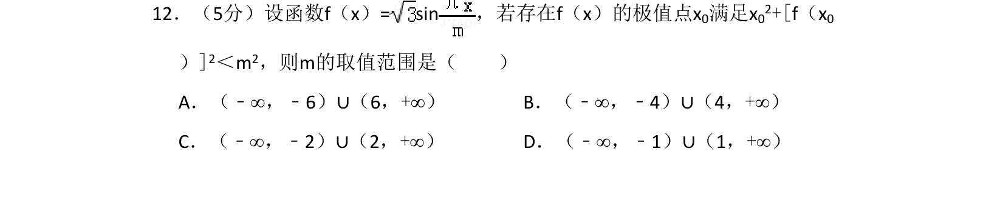
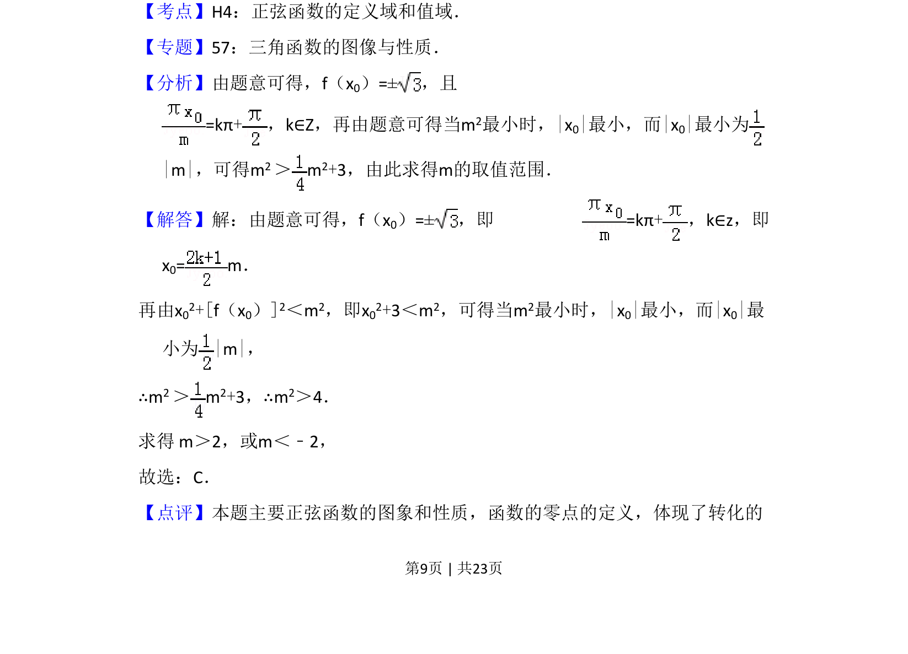
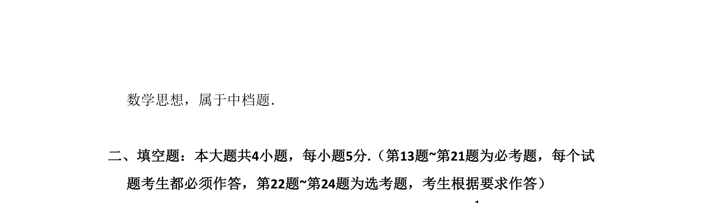

## 题面

## 摘要

本题通过正弦函数极值点构造不等式，求参数 m 的取值范围。

## 关联考点

- [[963-正弦函数的极值点|正弦函数的极值点]]
- [[623-不等式求解|不等式求解]]
- [[1125-转化思想|转化思想]]

## 答案与解析

> 📄 原 PDF 第 9 页：`素材/真题/吉林/2008-2024·（吉林）数学高考真题/2014年高考数学试卷（理）（新课标Ⅱ）（解析卷）.pdf`

<!-- 题干文本-start -->
## 题干文本
12．（5分）设函数f（x）= sin，若存在f（x）的极值点x 0满足x02+[f（x0
）]2＜m2，则m的取值范围是（　　）
A．（﹣∞，﹣6）∪（6，+∞）B．（﹣∞，﹣4）∪（4，+∞）
C．（﹣∞，﹣2）∪（2，+∞）D．（﹣∞，﹣1）∪（1，+∞）
<!-- 题干文本-end -->

<!-- 解析文本-start -->
## 解析文本
【考点】H4：正弦函数的定义域和值域．菁优网版权所有
【专题】57：三角函数的图像与性质．
【分析】由题意可得，f（x0）=±，且 
=kπ+，k∈Z，再由题意可得当m 2最小时，|x0|最小，而|x0|最小为
|m|，可得m2 ＞m 2+3，由此求得m的取值范围．
【解答】解：由题意可得，f（x0）=±，即 =kπ+，k∈z，即 
x0= m．
再由x02+[f（x0）]2＜m2，即x02+3＜m2，可得当m2最小时，|x0|最小，而|x0|最
小为|m|，
∴m2 ＞m 2+3，∴m2＞4． 
求得 m＞2，或m＜﹣2，
故选：C．
【点评】本题主要正弦函数的图象和性质，函数的零点的定义，体现了转化的
<!-- 解析文本-end -->
