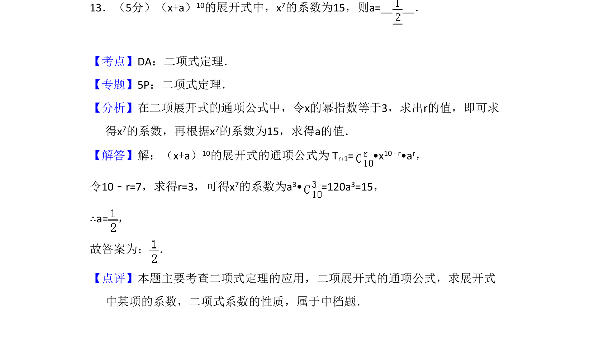
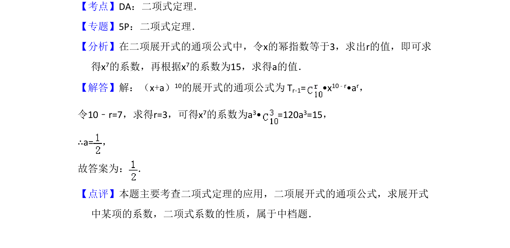

## 题面

## 摘要

该题考查二项式定理中通项公式的应用，求展开式中特定项的系数。

## 关联考点

- [[472-二项式定理|二项式定理]]
- [[384-数列通项公式|通项公式]]

## 答案与解析

> 📄 原 PDF 第 10 页：`素材/真题/吉林/2008-2024·（吉林）数学高考真题/2014年高考数学试卷（理）（新课标Ⅱ）（解析卷）.pdf`

<!-- 题干文本-start -->
## 题干文本
13．（5分）（x+a）10的展开式中，x7的系数为15，则a=　 　．
<!-- 题干文本-end -->

<!-- 解析文本-start -->
## 解析文本
【考点】DA：二项式定理．菁优网版权所有
【专题】5P：二项式定理．
【分析】在二项展开式的通项公式中，令x的幂指数等于3，求出r的值，即可求
得x7的系数，再根据x7的系数为15，求得a的值．
【解答】解：（x+a）10的展开式的通项公式为 Tr+1= •x 10﹣r•ar，
令10﹣r=7，求得r=3，可得x7的系数为a3• =120a 3=15，
∴a=，
故答案为： ．
【点评】本题主要考查二项式定理的应用，二项展开式的通项公式，求展开式
中某项的系数，二项式系数的性质，属于中档题．
<!-- 解析文本-end -->
