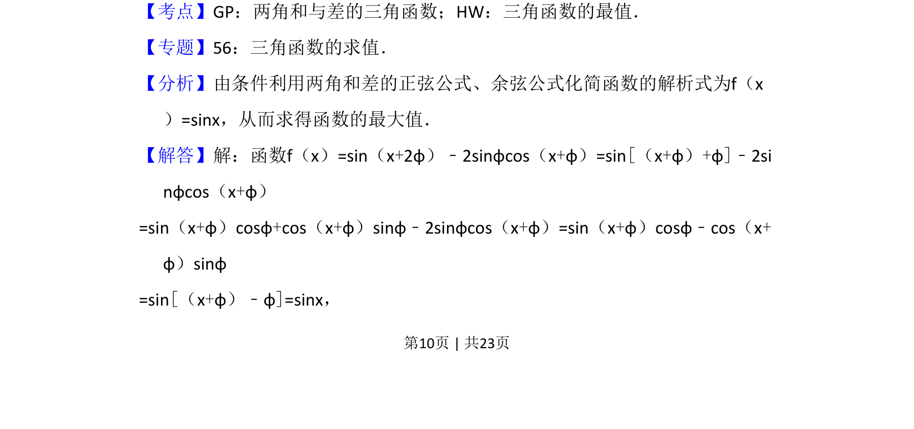
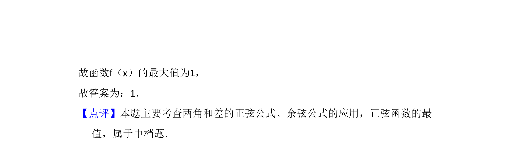

## 题面

## 摘要

函数化简为sinx，利用两角和差公式求三角函数最大值。

## 关联考点

- [[628-两角和与差的三角函数|两角和与差的三角函数]]
- [[615-三角函数的最值|三角函数的最值]]

## 答案与解析

> 📄 原 PDF 第 10 页：`素材/真题/吉林/2008-2024·（吉林）数学高考真题/2014年高考数学试卷（理）（新课标Ⅱ）（解析卷）.pdf`

<!-- 题干文本-start -->
## 题干文本
14．（5分）函数f（x）=sin（x+2φ）﹣2sinφcos（x+φ）的最大值为　1　．
<!-- 题干文本-end -->

<!-- 解析文本-start -->
## 解析文本
【考点】GP：两角和与差的三角函数；HW：三角函数的最值．菁优网版权所有
【专题】56：三角函数的求值．
【分析】由条件利用两角和差的正弦公式、余弦公式化简函数的解析式为f（x
）=sinx，从而求得函数的最大值．
【解答】解：函数f（x）=sin（x+2φ）﹣2sinφcos（x+φ）=sin[（x+φ）+φ]﹣2si
nφcos（x+φ）
=sin（x+φ）cosφ+cos（x+φ）sinφ﹣2sinφcos（x+φ）=sin（x+φ）cosφ﹣cos（x+
φ）sinφ
=sin[（x+φ）﹣φ]=sinx，
<!-- 解析文本-end -->
