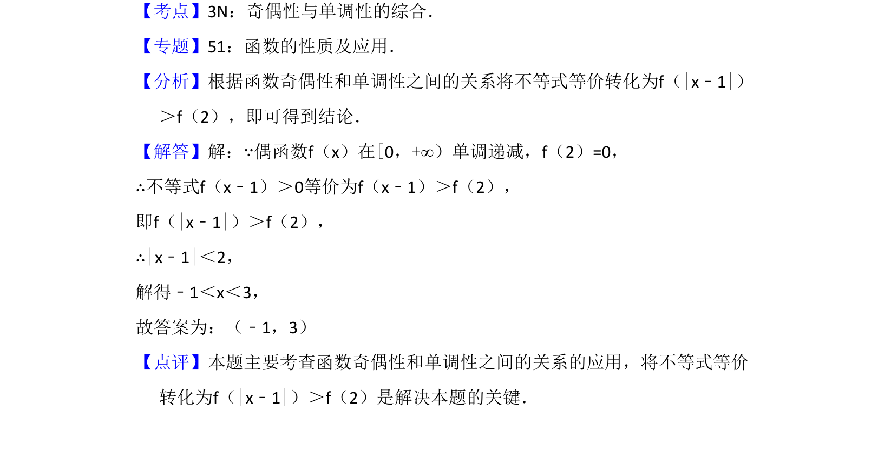

## 题面

## 摘要

利用偶函数单调性将抽象不等式转化为绝对值不等式求解。

## 关联考点

- [[284-函数的奇偶性|函数的奇偶性]]
- [[282-函数的单调性|函数的单调性]]
- [[抽象不等式]]

## 答案与解析

> 📄 原 PDF 第 11 页：`素材/真题/吉林/2008-2024·（吉林）数学高考真题/2014年高考数学试卷（理）（新课标Ⅱ）（解析卷）.pdf`
