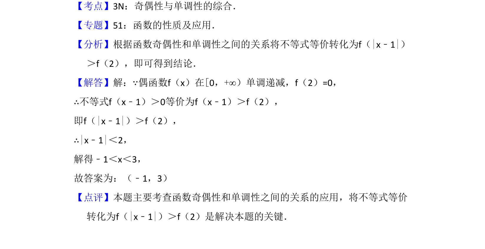

## 题面

## 摘要

利用偶函数单调性将抽象不等式转化为绝对值不等式求解。

## 关联考点

- [[284-函数的奇偶性|函数的奇偶性]]
- [[282-函数的单调性|函数的单调性]]
- [[552-抽象不等式|抽象不等式]]

## 答案与解析

> 📄 原 PDF 第 11 页：`素材/真题/吉林/2008-2024·（吉林）数学高考真题/2014年高考数学试卷（理）（新课标Ⅱ）（解析卷）.pdf`

<!-- 题干文本-start -->
## 题干文本
15．（5分）已知偶函数f（x）在[0，+∞）单调递减，f（2）=0，若f（x﹣1）
＞0，则x的取值范围是　（﹣1，3）　．
<!-- 题干文本-end -->

<!-- 解析文本-start -->
## 解析文本
【考点】3N：奇偶性与单调性的综合．菁优网版权所有
【专题】51：函数的性质及应用．
【分析】根据函数奇偶性和单调性之间的关系将不等式等价转化为f（|x﹣1|）
＞f（2），即可得到结论．
【解答】解：∵偶函数f（x）在[0，+∞）单调递减，f（2）=0，
∴不等式f（x﹣1）＞0等价为f（x﹣1）＞f（2），
即f（|x﹣1|）＞f（2），
∴|x﹣1|＜2，
解得﹣1＜x＜3，
故答案为：（﹣1，3）
【点评】本题主要考查函数奇偶性和单调性之间的关系的应用，将不等式等价
转化为f（|x﹣1|）＞f（2）是解决本题的关键．
<!-- 解析文本-end -->
