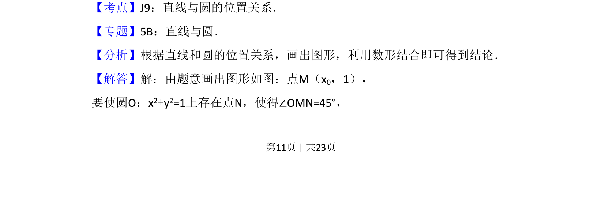
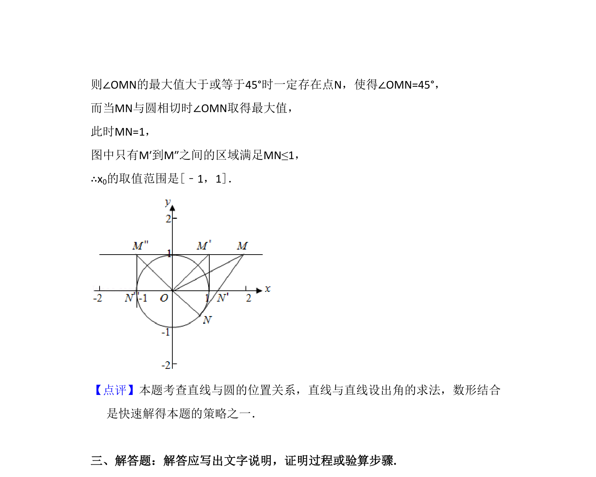

## 题面

## 摘要

已知点坐标和圆上存在点满足角度条件，求横坐标取值范围，考查直线与圆的位置关系

## 关联考点

- [[394-直线和圆位置关系-高中|直线与圆的位置关系]]
- [[898-数形结合思想|数形结合思想]]

## 答案与解析

> 📄 原 PDF 第 11 页：`素材/真题/吉林/2008-2024·（吉林）数学高考真题/2014年高考数学试卷（理）（新课标Ⅱ）（解析卷）.pdf`
