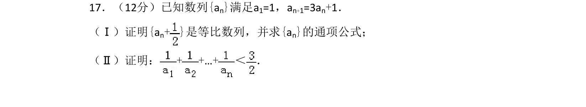
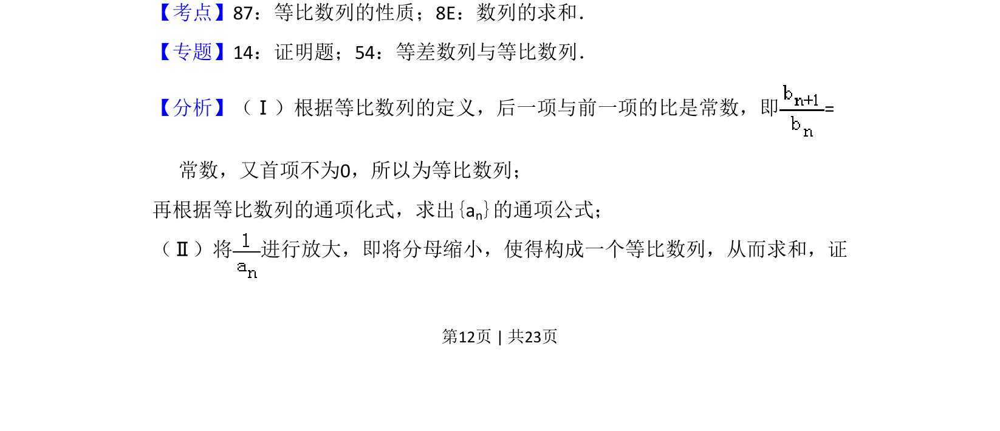
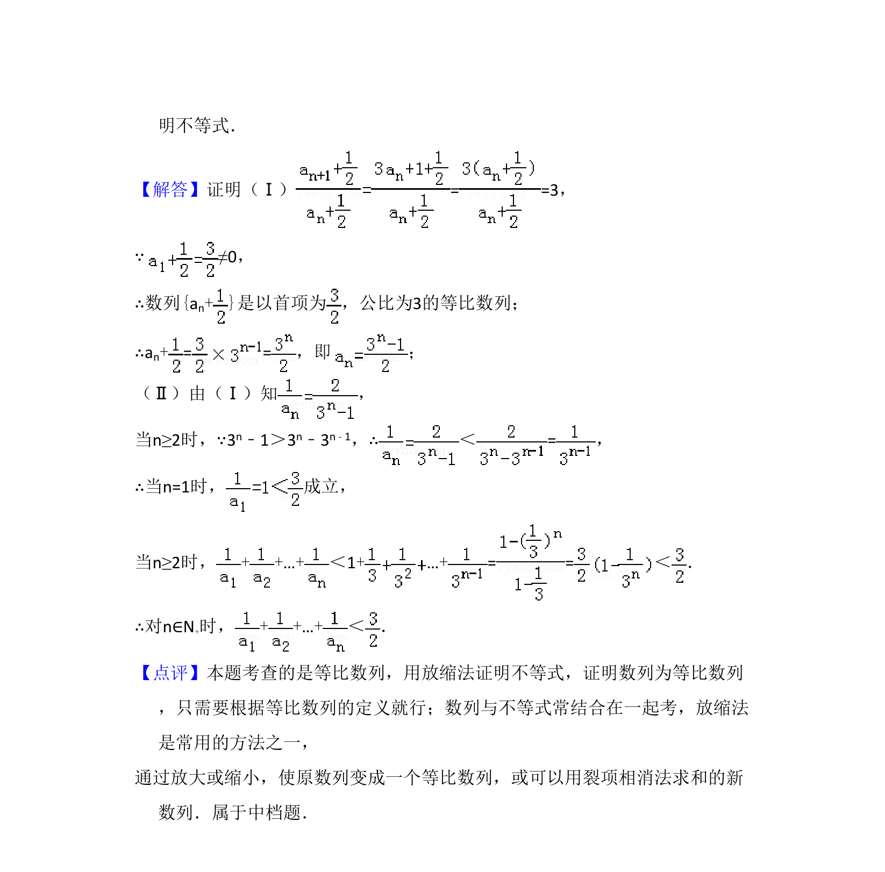

## 题面

## 摘要

本题考查等比数列定义与通项公式，并用放缩法证明数列不等式。

## 关联考点

- [[1067-等比数列的定义与通项公式|等比数列的定义与通项公式]]
- [[1081-累加求和|数列求和]]
- [[453-数列不等式证明|放缩法]]

## 答案与解析

> 📄 原 PDF 第 12 页：`素材/真题/吉林/2008-2024·（吉林）数学高考真题/2014年高考数学试卷（理）（新课标Ⅱ）（解析卷）.pdf`
