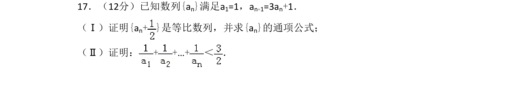
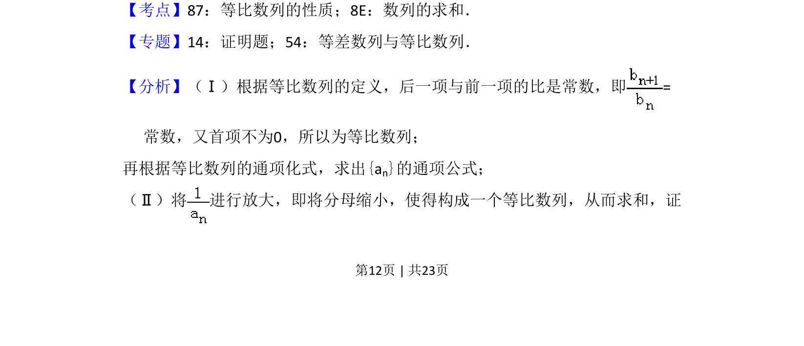
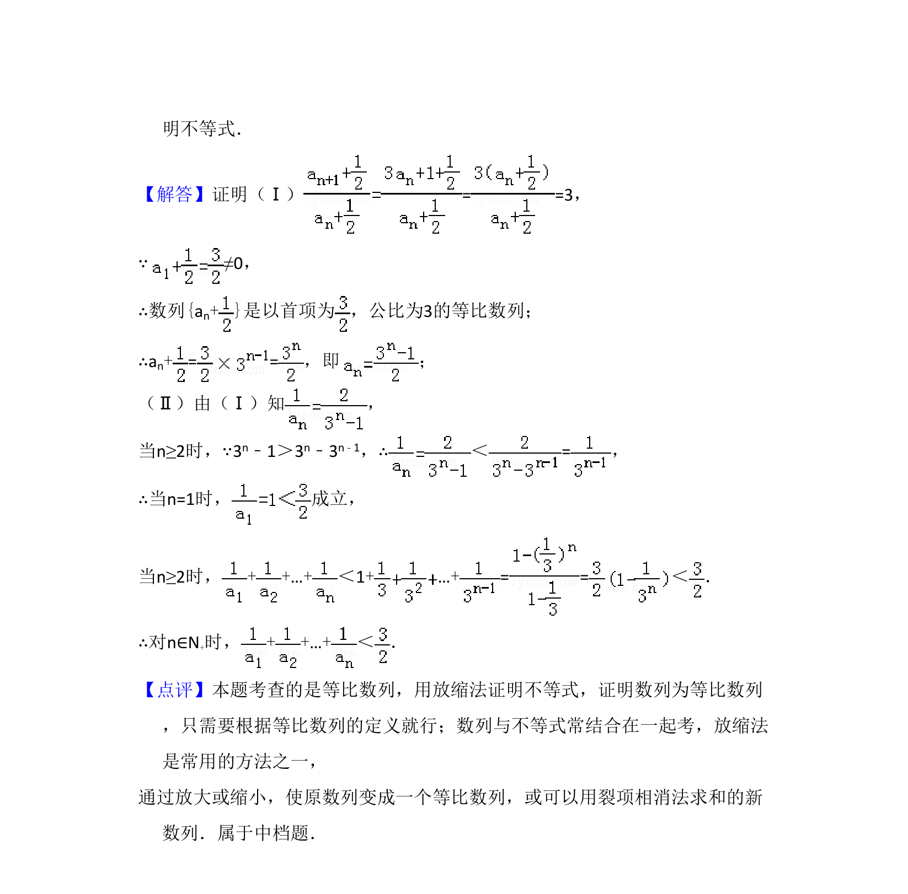

## 题面

## 摘要

本题考查等比数列定义与通项公式，并用放缩法证明数列不等式。

## 关联考点

- [[1067-等比数列的定义与通项公式|等比数列的定义与通项公式]]
- [[1081-累加求和|数列求和]]
- [[453-数列不等式证明|放缩法]]

## 答案与解析

> 📄 原 PDF 第 12 页：`素材/真题/吉林/2008-2024·（吉林）数学高考真题/2014年高考数学试卷（理）（新课标Ⅱ）（解析卷）.pdf`

<!-- 题干文本-start -->
## 题干文本
17．（12分）已知数列{an}满足a1=1，an+1=3an+1．
（Ⅰ）证明{an+ }是等比数列，并求{a n}的通项公式；
（Ⅱ）证明：+ +…+＜ ．
<!-- 题干文本-end -->

<!-- 解析文本-start -->
## 解析文本
【考点】87：等比数列的性质；8E：数列的求和．菁优网版权所有
【专题】14：证明题；54：等差数列与等比数列．
【分析】（Ⅰ）根据等比数列的定义，后一项与前一项的比是常数，即=
常数，又首项不为0，所以为等比数列； 
再根据等比数列的通项化式，求出{an}的通项公式；
（Ⅱ）将 进行放大，即将分母缩小，使得构成一个等比数列，从而求和，证
<!-- 解析文本-end -->
