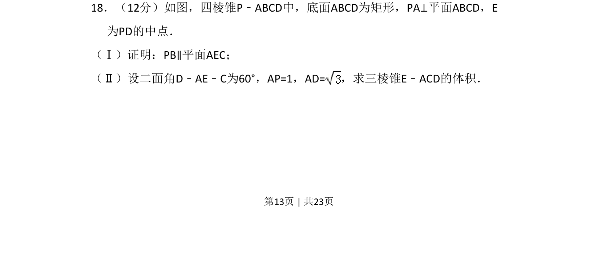
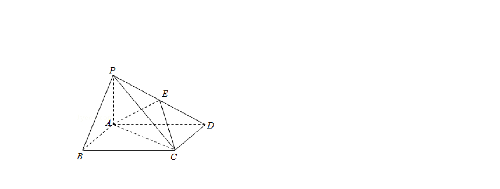
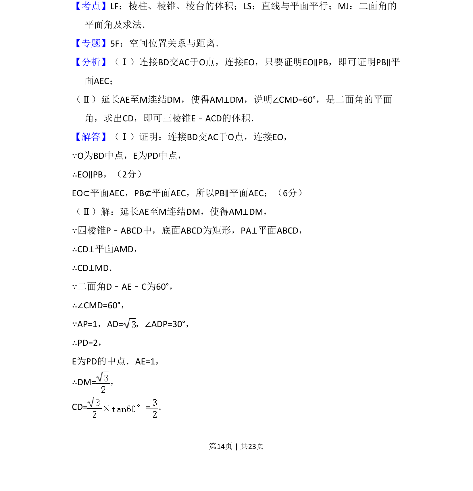
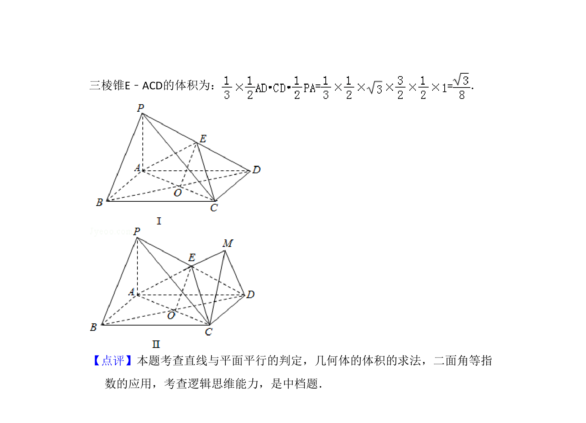

## 题面

## 摘要

以四棱锥为载体，考查线面平行证明及已知二面角求三棱锥体积。

## 关联考点

- [[352-空间直线平面平行|线面平行]]
- [[353-空间角|二面角]]
- [[1204-锥体体积|锥体体积]]

## 答案与解析

> 📄 原 PDF 第 13 页：`素材/真题/吉林/2008-2024·（吉林）数学高考真题/2014年高考数学试卷（理）（新课标Ⅱ）（解析卷）.pdf`
