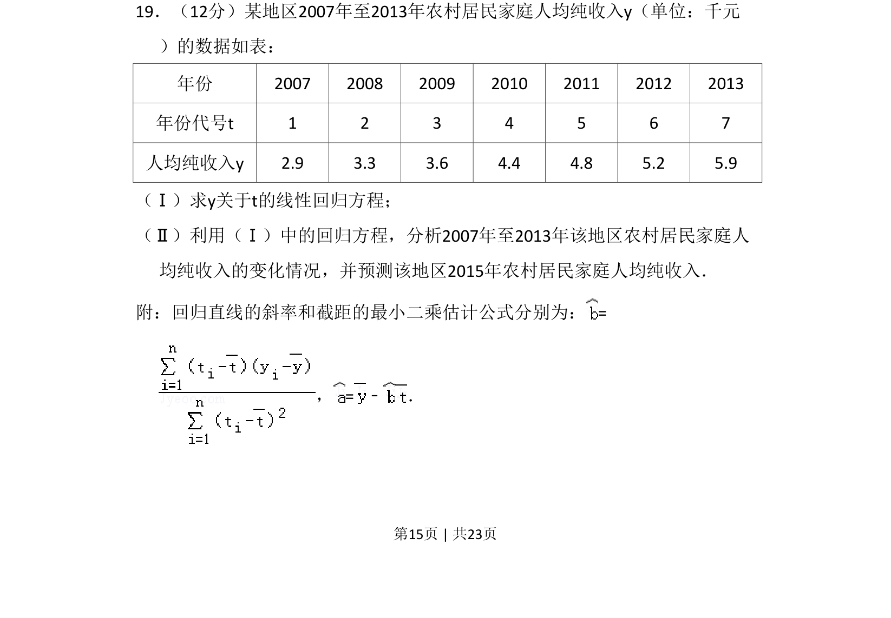
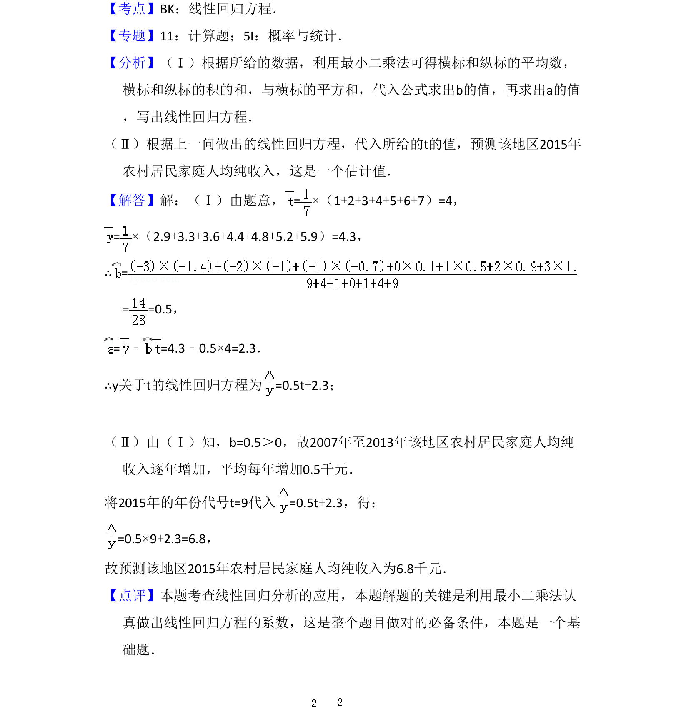

## 题面

## 摘要

该题考查根据给定数据求线性回归方程，并结合方程进行变化分析与预测。

## 关联考点

- [[359-统计案例|线性回归]]
- [[491-最小二乘法|最小二乘法]]
- [[1098-统计预测|统计预测]]

## 答案与解析

> 📄 原 PDF 第 15 页：`素材/真题/吉林/2008-2024·（吉林）数学高考真题/2014年高考数学试卷（理）（新课标Ⅱ）（解析卷）.pdf`
