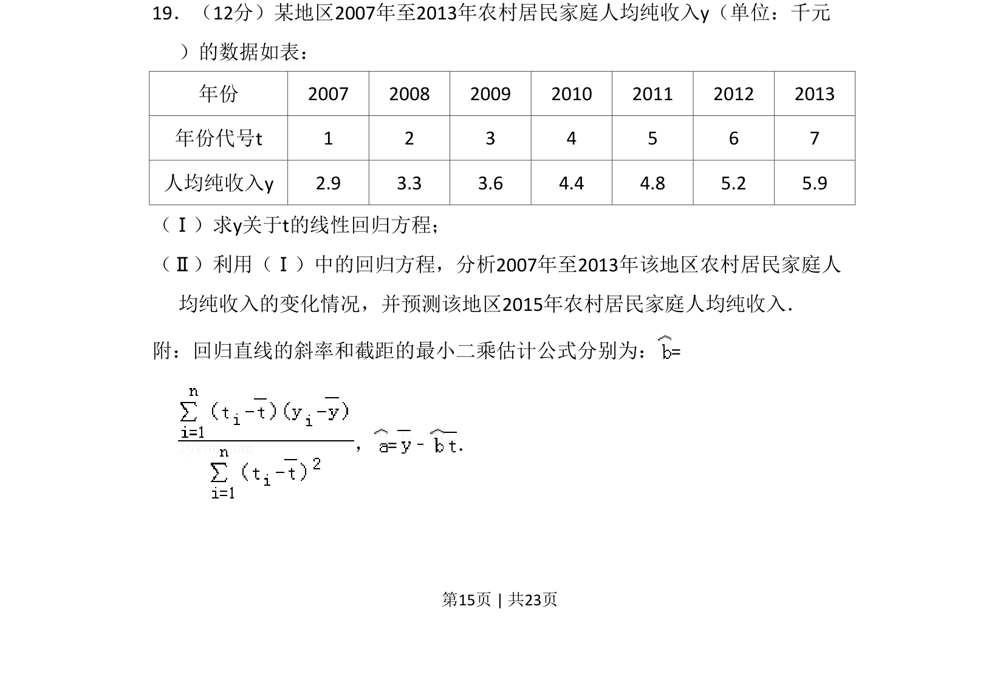
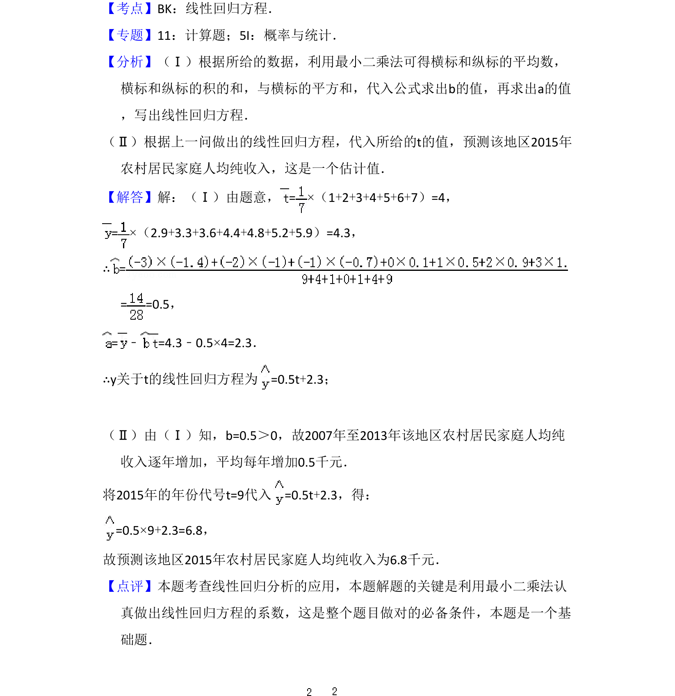

## 题面

## 摘要

该题考查根据给定数据求线性回归方程，并结合方程进行变化分析与预测。

## 关联考点

- [[359-统计案例|线性回归]]
- [[491-最小二乘法|最小二乘法]]
- [[1098-统计预测|统计预测]]

## 答案与解析

> 📄 原 PDF 第 15 页：`素材/真题/吉林/2008-2024·（吉林）数学高考真题/2014年高考数学试卷（理）（新课标Ⅱ）（解析卷）.pdf`

<!-- 题干文本-start -->
## 题干文本
19．（12分）某地区2007年至2013年农村居民家庭人均纯收入y（单位：千元
）的数据如表：
年份 2007 2008 2009 2010 2011 2012 2013
年份代号t 1 2 3 4 5 6 7
人均纯收入y 2.9 3.3 3.6 4.4 4.8 5.2 5.9
（Ⅰ）求y关于t的线性回归方程；
（Ⅱ）利用（Ⅰ）中的回归方程，分析2007年至2013年该地区农村居民家庭人
均纯收入的变化情况，并预测该地区2015年农村居民家庭人均纯收入．
附：回归直线的斜率和截距的最小二乘估计公式分别为：=
，=﹣ ．
<!-- 题干文本-end -->

<!-- 解析文本-start -->
## 解析文本

<!-- 解析文本-end -->
