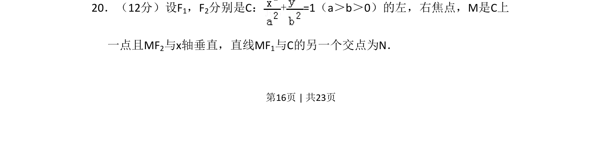
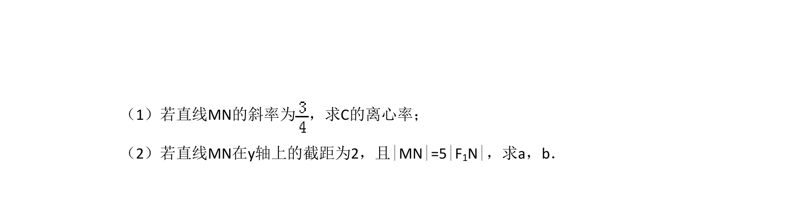
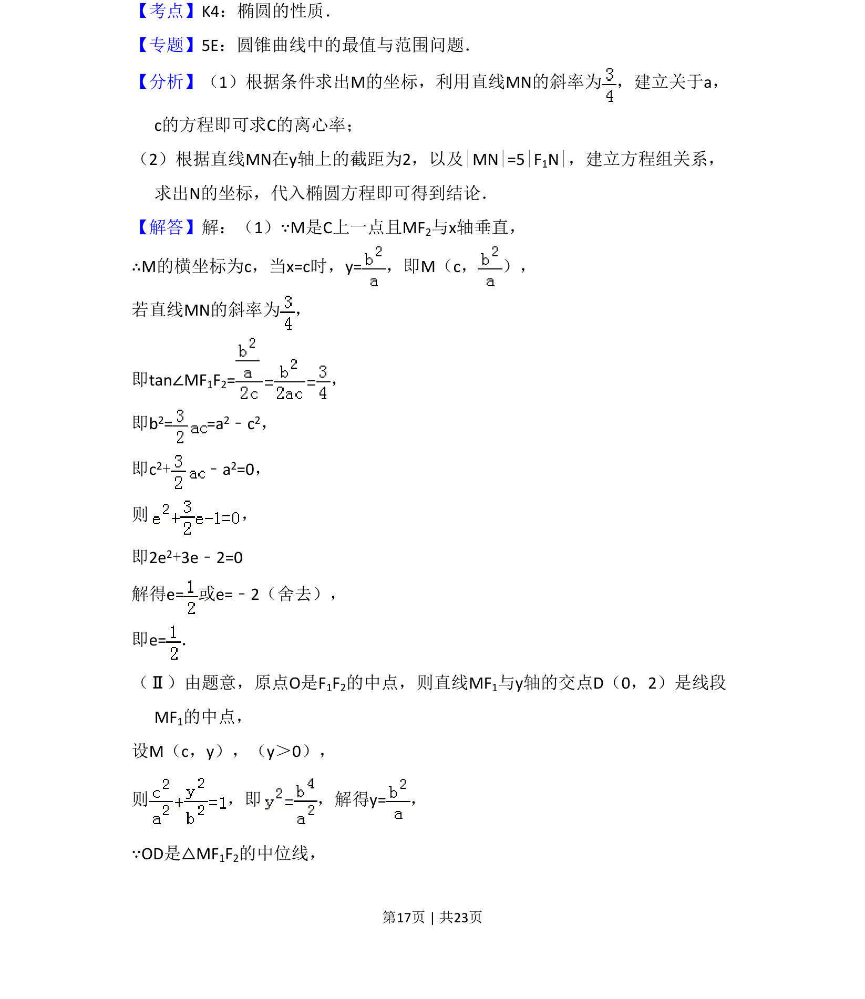
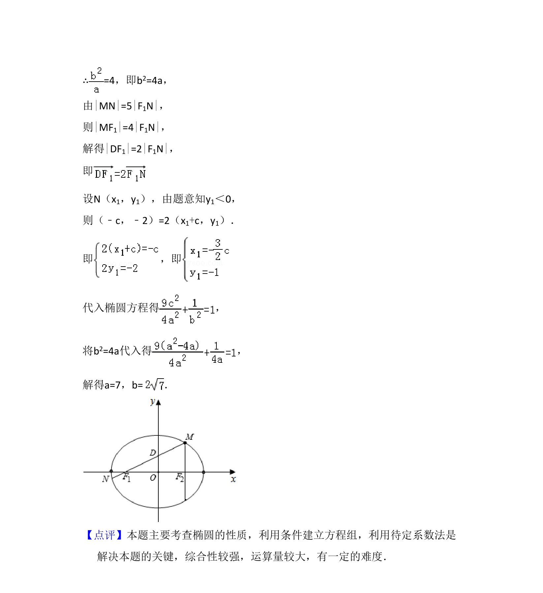

## 题面

## 摘要

椭圆中给定焦点和垂直条件，求直线与椭圆的另一交点相关问题。

## 关联考点

- [[389-椭圆定义与方程|椭圆]]
- [[037-焦点焦距|焦点]]
- [[1008-直线与圆锥曲线相交|直线与圆锥曲线相交]]
- [[788-坐标运算|坐标运算]]

## 答案与解析

> 📄 原 PDF 第 16 页：`素材/真题/吉林/2008-2024·（吉林）数学高考真题/2014年高考数学试卷（理）（新课标Ⅱ）（解析卷）.pdf`
