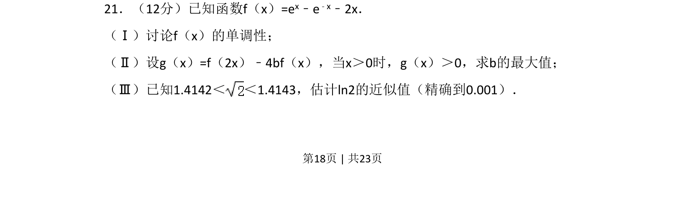
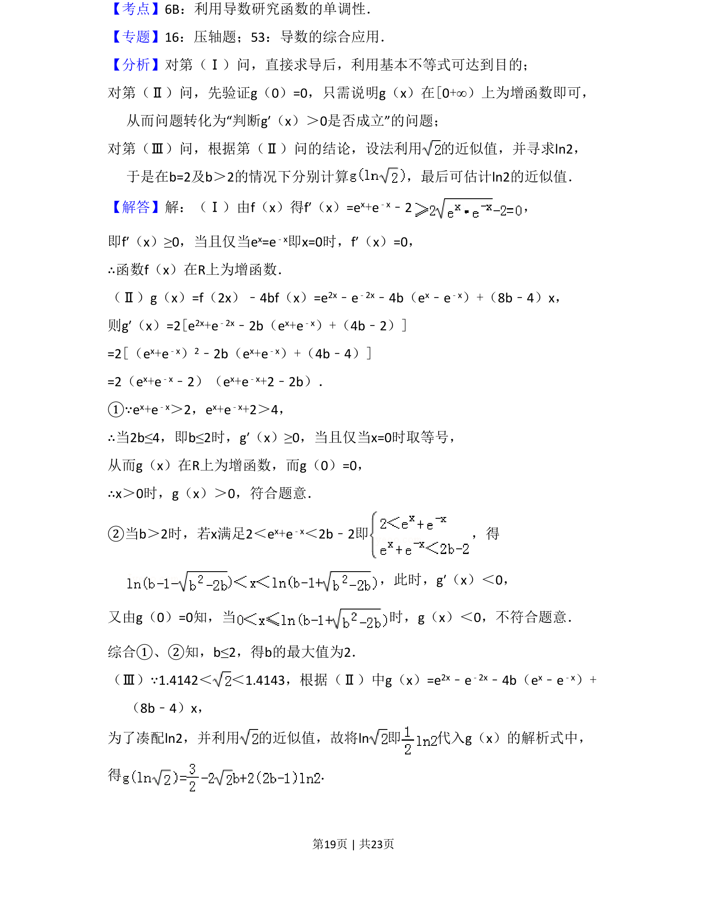
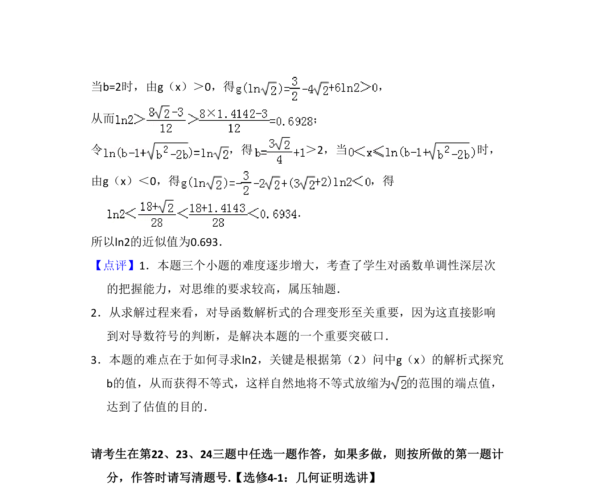

## 题面

## 摘要

考查利用导数研究函数单调性，结合不等式恒成立求参数最值，并估计对数值。

## 关联考点

- [[导数与单调性]]
- [[不等式恒成立]]
- [[参数最值]]
- [[近似计算]]

## 答案与解析

> 📄 原 PDF 第 18 页：`素材/真题/吉林/2008-2024·（吉林）数学高考真题/2014年高考数学试卷（理）（新课标Ⅱ）（解析卷）.pdf`
