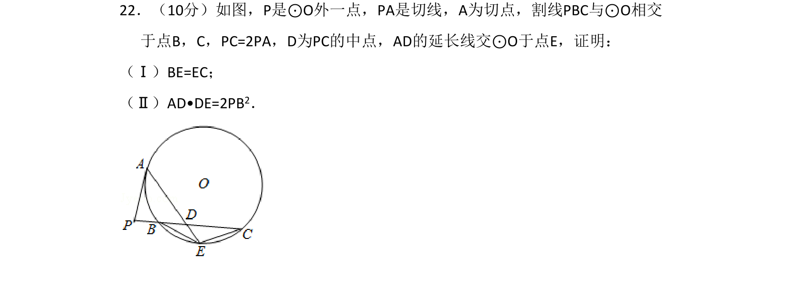
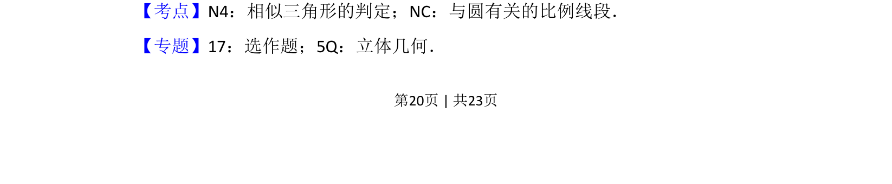
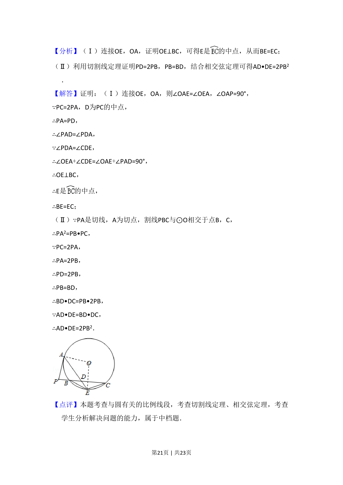

## 题面

## 摘要

本题考查圆的切线、割线性质，通过相似三角形及比例关系证明线段相等与等积式。

## 关联考点

- [[1035-相似三角形的判定|相似三角形的判定]]
- [[1176-与圆有关的比例线段|与圆有关的比例线段]]

## 答案与解析

> 📄 原 PDF 第 20 页：`素材/真题/吉林/2008-2024·（吉林）数学高考真题/2014年高考数学试卷（理）（新课标Ⅱ）（解析卷）.pdf`
