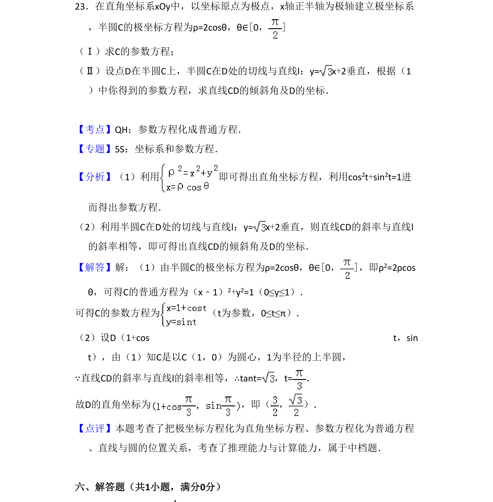
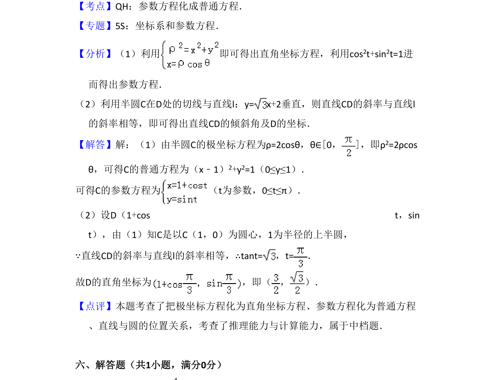

## 题面

## 摘要

极坐标与参数方程转化，利用切线斜率关系求点的坐标及倾斜角。

## 关联考点

- [[922-极坐标方程|极坐标方程]]
- [[061-方程|参数方程]]
- [[544-圆的参数方程|圆的参数方程]]
- [[577-直线斜率|直线斜率]]

## 答案与解析

> 📄 原 PDF 第 22 页：`素材/真题/吉林/2008-2024·（吉林）数学高考真题/2014年高考数学试卷（理）（新课标Ⅱ）（解析卷）.pdf`
