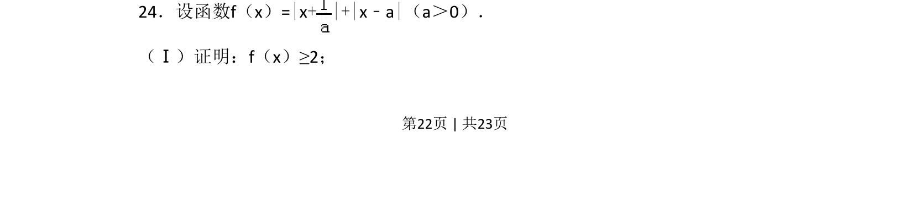
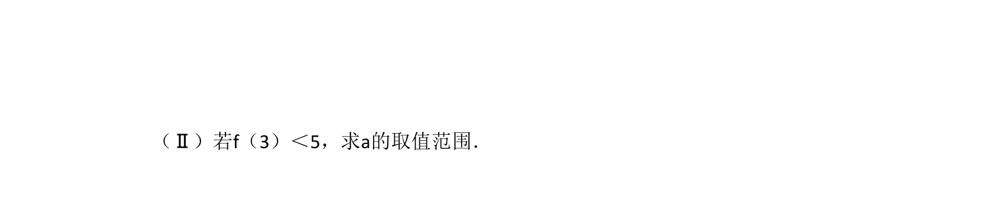
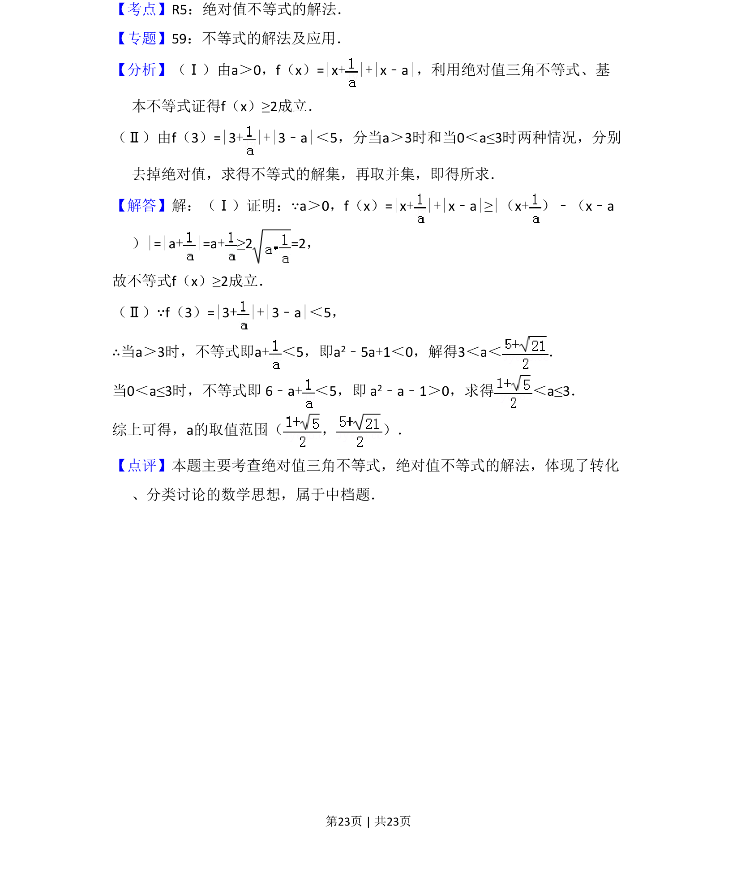

## 题面

## 摘要

考查含参绝对值函数的最小值证明，利用绝对值三角不等式直接放缩。

## 关联考点

- [[1093-绝对值不等式|绝对值不等式]]
- [[1159-绝对值三角不等式|绝对值三角不等式]]
- [[286-函数的最值|最值]]

## 答案与解析

> 📄 原 PDF 第 22 页：`素材/真题/吉林/2008-2024·（吉林）数学高考真题/2014年高考数学试卷（理）（新课标Ⅱ）（解析卷）.pdf`
