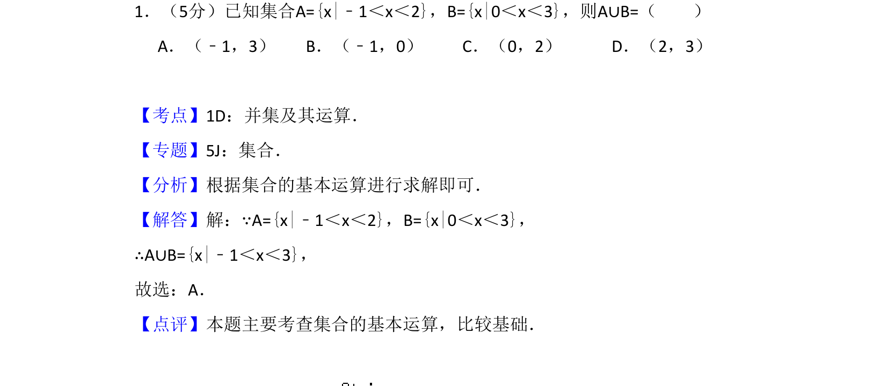
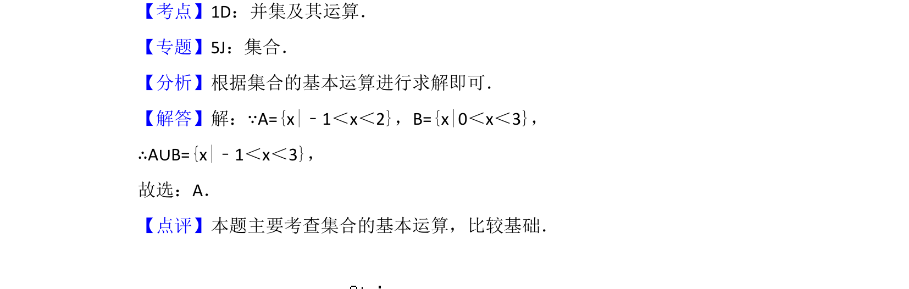

## 题面

## 摘要

本题主要考查集合的并集运算，通过求解不等式表示的区间集合求并集。

## 关联考点

- [[042-集合|集合]]
- [[860-并集运算|并集运算]]

## 答案与解析

> 📄 原 PDF 第 1 页：`素材/真题/吉林/2008-2024·（吉林）数学高考真题/2015年高考数学试卷（文）（新课标Ⅱ）（解析卷）.pdf`

<!-- 题干文本-start -->
## 题干文本
1．（5分）已知集合A={x|﹣1＜x＜2}，B={x|0＜x＜3}，则A∪B=（　　）
A．（﹣1，3）B．（﹣1，0）C．（0，2）D．（2，3）
<!-- 题干文本-end -->

<!-- 解析文本-start -->
## 解析文本
【考点】1D：并集及其运算．菁优网版权所有
【专题】5J：集合．
【分析】根据集合的基本运算进行求解即可．
【解答】解：∵A={x|﹣1＜x＜2}，B={x|0＜x＜3}，
∴A∪B={x|﹣1＜x＜3}，
故选：A．
【点评】本题主要考查集合的基本运算，比较基础．
<!-- 解析文本-end -->
