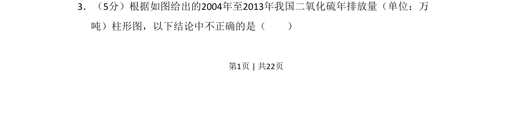
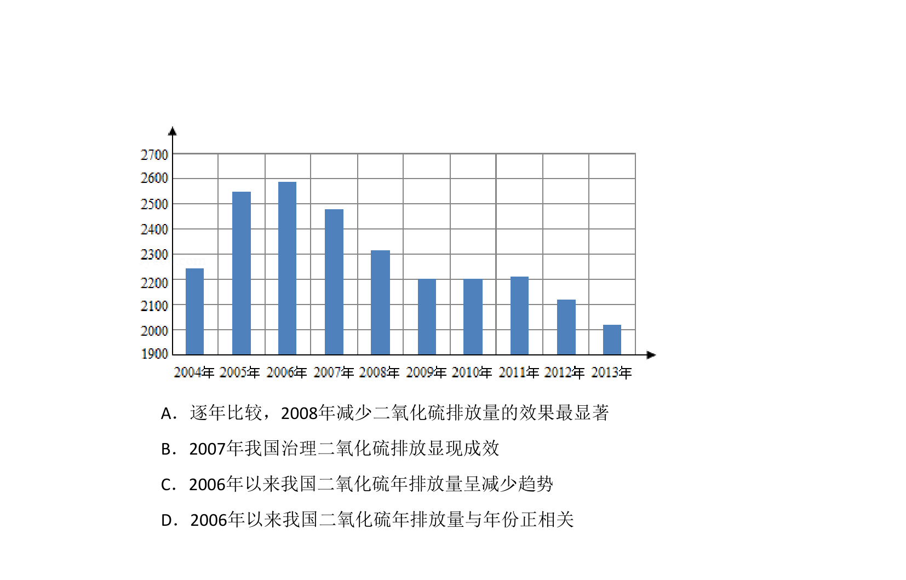
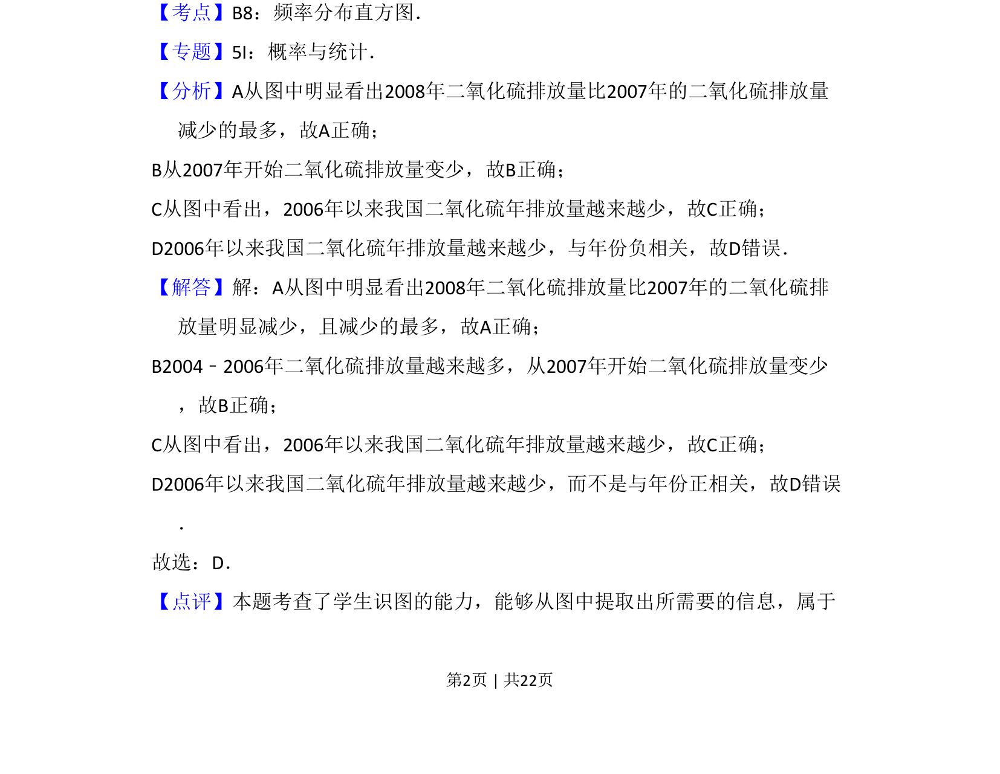
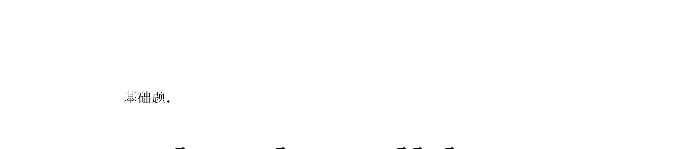

## 题面

## 摘要

该题考查柱形图数据读取与分析，要求判断关于二氧化硫年排放量变化趋势结论的正误。

## 关联考点

- [[1097-统计图表分析|统计图表分析]]
- [[555-数据推理|数据推理]]
- [[1120-趋势判断|趋势判断]]

## 答案与解析

> 📄 原 PDF 第 1 页：`素材/真题/吉林/2008-2024·（吉林）数学高考真题/2015年高考数学试卷（文）（新课标Ⅱ）（解析卷）.pdf`
