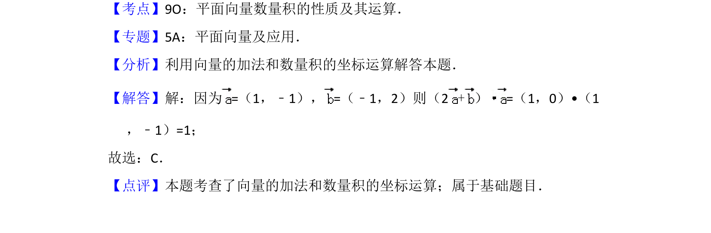

## 题面

## 摘要

该题考查平面向量的加法和数量积的坐标运算，直接代入公式计算。

## 关联考点

- [[335-平面向量坐标运算|平面向量坐标运算]]
- [[323-向量的加法|向量加法]]
- [[556-数量积坐标运算|数量积坐标运算]]

## 答案与解析

> 📄 原 PDF 第 3 页：`素材/真题/吉林/2008-2024·（吉林）数学高考真题/2015年高考数学试卷（文）（新课标Ⅱ）（解析卷）.pdf`
