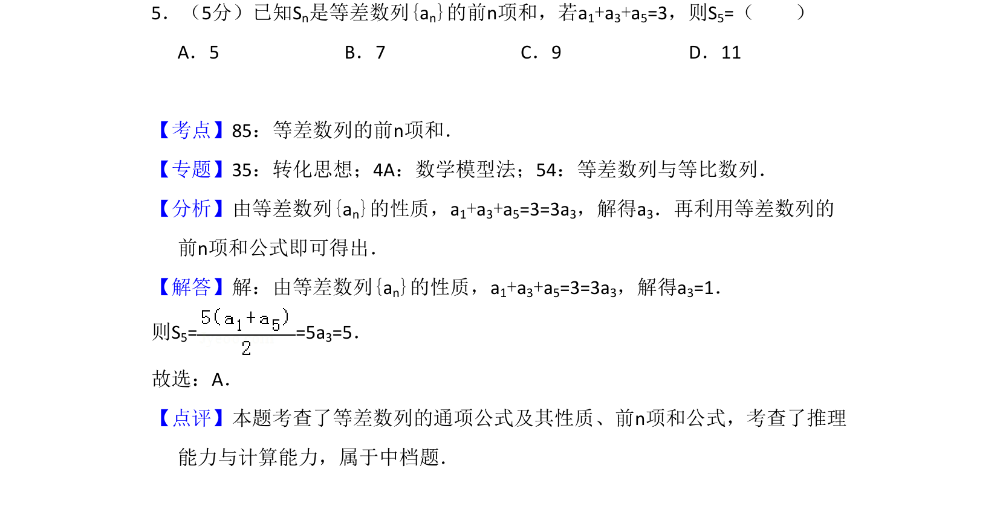
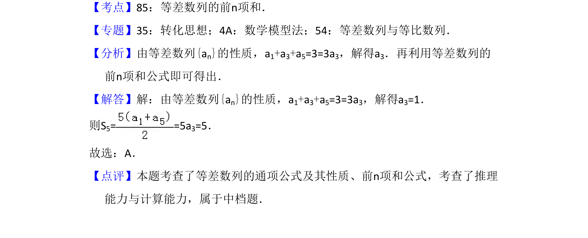

## 题面

## 摘要

已知等差数列部分项之和，利用等差中项性质求a3，再通过前n项和公式计算S5。

## 关联考点

- [[412-等差数列性质|等差数列性质]]
- [[355-等差数列前n项和|等差数列前n项和]]

## 答案与解析

> 📄 原 PDF 第 3 页：`素材/真题/吉林/2008-2024·（吉林）数学高考真题/2015年高考数学试卷（文）（新课标Ⅱ）（解析卷）.pdf`
