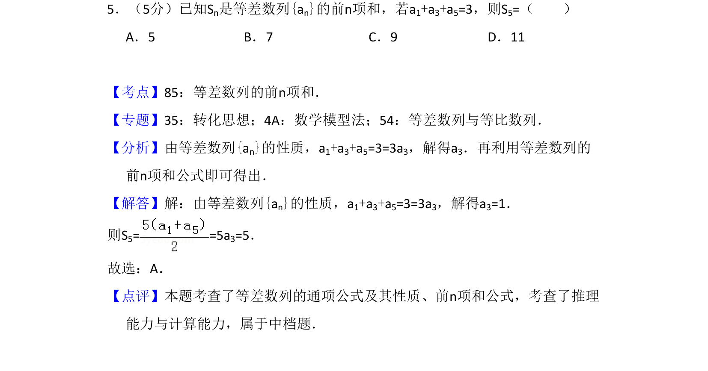
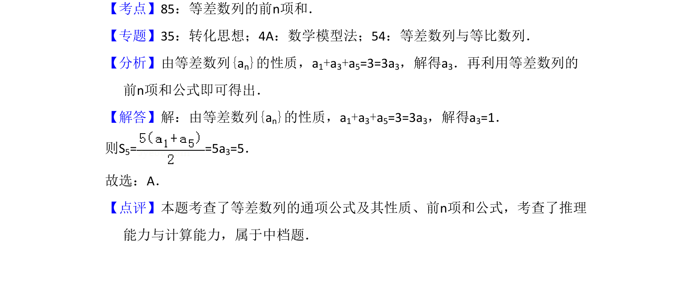

## 题面

## 摘要

已知等差数列部分项之和，利用等差中项性质求a3，再通过前n项和公式计算S5。

## 关联考点

- [[412-等差数列性质|等差数列性质]]
- [[355-等差数列前n项和|等差数列前n项和]]

## 答案与解析

> 📄 原 PDF 第 3 页：`素材/真题/吉林/2008-2024·（吉林）数学高考真题/2015年高考数学试卷（文）（新课标Ⅱ）（解析卷）.pdf`

<!-- 题干文本-start -->
## 题干文本
5．（5分）已知Sn是等差数列{an}的前n项和，若a1+a3+a5=3，则S5=（　　）
A．5 B．7 C．9 D．11
<!-- 题干文本-end -->

<!-- 解析文本-start -->
## 解析文本
【考点】85：等差数列的前n项和．菁优网版权所有
【专题】35：转化思想；4A：数学模型法；54：等差数列与等比数列．
【分析】由等差数列{an}的性质，a1+a3+a5=3=3a3，解得a3．再利用等差数列的
前n项和公式即可得出．
【解答】解：由等差数列{an}的性质，a1+a3+a5=3=3a3，解得a3=1．
则S5= =5a 3=5．
故选：A．
【点评】本题考查了等差数列的通项公式及其性质、前n项和公式，考查了推理
能力与计算能力，属于中档题．
<!-- 解析文本-end -->
