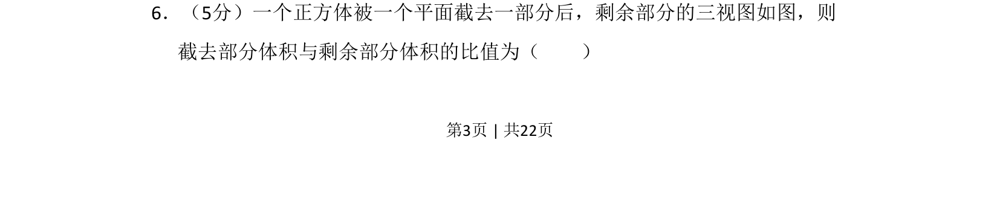
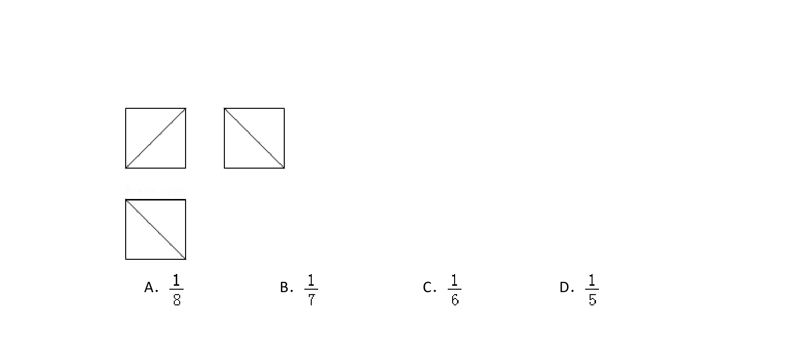
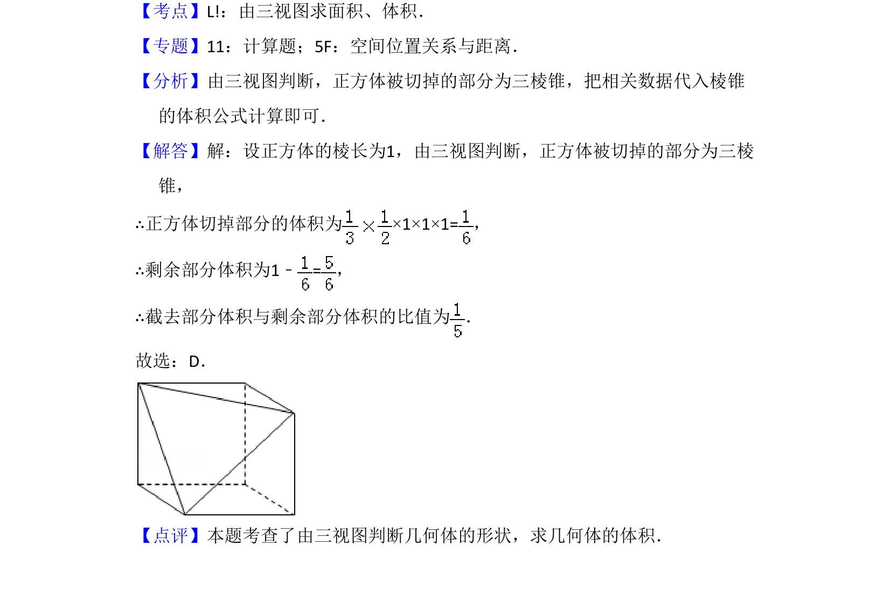

## 题面

## 摘要

一个正方体截去一角后，通过三视图求截去部分与剩余部分体积之比。

## 关联考点

- [[235-三视图|三视图]]
- [[348-空间几何体体积|空间几何体体积]]
- [[968-正方体截面|正方体截面]]

## 答案与解析

> 📄 原 PDF 第 3 页：`素材/真题/吉林/2008-2024·（吉林）数学高考真题/2015年高考数学试卷（文）（新课标Ⅱ）（解析卷）.pdf`
