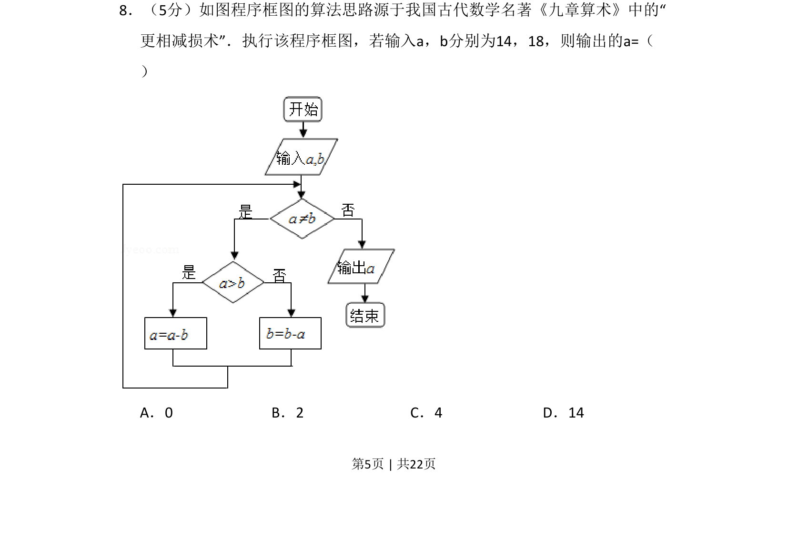
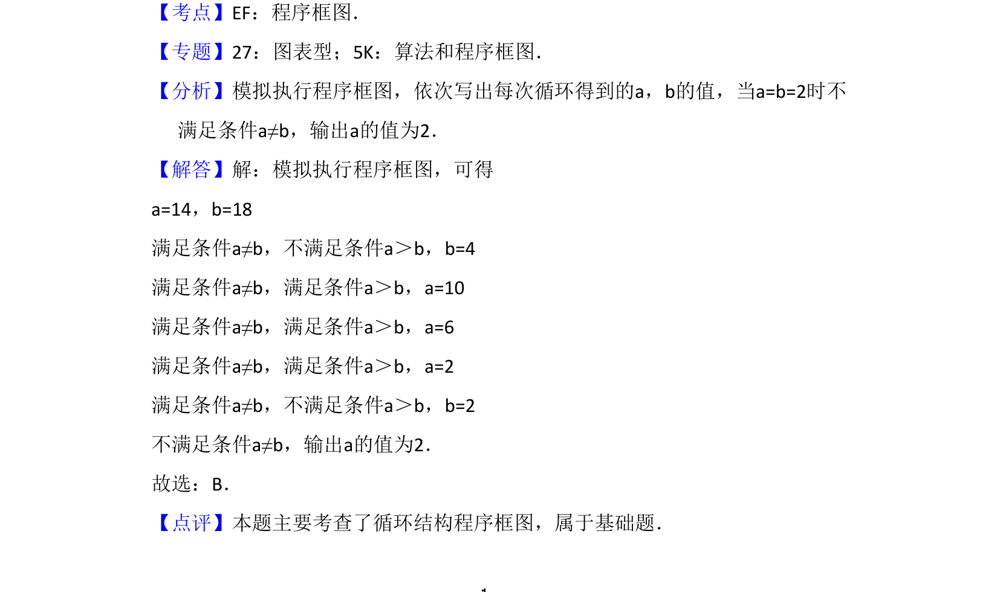

## 题面

## 摘要

该题考查以程序框图形式呈现的《九章算术》更相减损术算法，通过循环结构求两数最大公约数。

## 关联考点

- [[1043-程序框图|程序框图]]
- [[912-更相减损术|更相减损术]]
- [[871-循环结构|循环结构]]
- [[560-最大公约数|最大公约数]]

## 答案与解析

> 📄 原 PDF 第 5 页：`素材/真题/吉林/2008-2024·（吉林）数学高考真题/2015年高考数学试卷（文）（新课标Ⅱ）（解析卷）.pdf`
