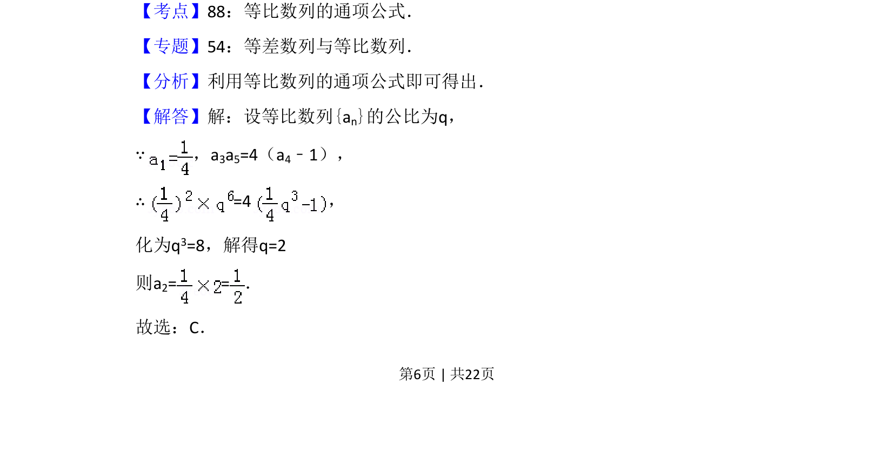

## 题面

## 摘要

该题考查等比数列通项公式的应用，通过给定条件求公比并计算指定项。

## 关联考点

- [[358-等比数列概念|等比数列]]
- [[384-数列通项公式|通项公式]]

## 答案与解析

> 📄 原 PDF 第 6 页：`素材/真题/吉林/2008-2024·（吉林）数学高考真题/2015年高考数学试卷（文）（新课标Ⅱ）（解析卷）.pdf`

<!-- 题干文本-start -->
## 题干文本
9．（5分）已知等比数列{an}满足a1=，a 3a5=4（a4﹣1），则a2=（　　）
A．2 B．1 C．D．
<!-- 题干文本-end -->

<!-- 解析文本-start -->
## 解析文本
【考点】88：等比数列的通项公式．菁优网版权所有
【专题】54：等差数列与等比数列．
【分析】利用等比数列的通项公式即可得出．
【解答】解：设等比数列{an}的公比为q，
∵，a 3a5=4（a4﹣1），
∴=4，
化为q3=8，解得q=2
则a2= =．
故选：C．
<!-- 解析文本-end -->
