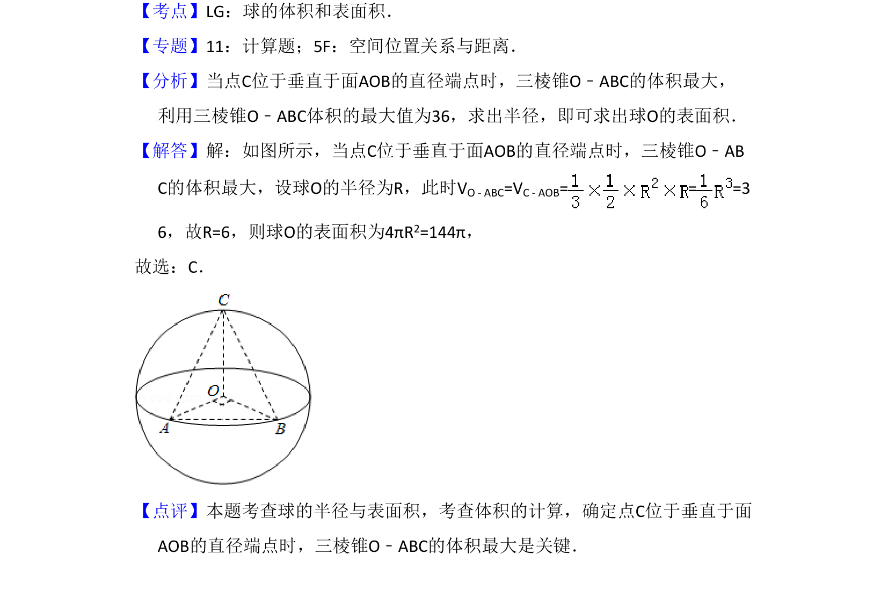

## 题面

## 摘要

当三棱锥体积最大时，利用几何关系求球半径，进而计算球的表面积。

## 关联考点

- [[993-球的表面积|球的表面积]]
- [[1191-三棱锥体积|三棱锥体积]]
- [[913-最值问题|最值问题]]

## 答案与解析

> 📄 原 PDF 第 7 页：`素材/真题/吉林/2008-2024·（吉林）数学高考真题/2015年高考数学试卷（文）（新课标Ⅱ）（解析卷）.pdf`

<!-- 题干文本-start -->
## 题干文本
10．（5分）已知A，B是球O的球面上两点，∠AOB=90°，C为该球面上的动点，
若三棱锥O﹣ABC体积的最大值为36，则球O的表面积为（　　）
A．36πB．64πC．144πD．256π
<!-- 题干文本-end -->

<!-- 解析文本-start -->
## 解析文本
【考点】LG：球的体积和表面积．菁优网版权所有
【专题】11：计算题；5F：空间位置关系与距离．
【分析】当点C位于垂直于面AOB的直径端点时，三棱锥O﹣ABC的体积最大，
利用三棱锥O﹣ABC体积的最大值为36，求出半径，即可求出球O的表面积．
【解答】解：如图所示，当点C位于垂直于面AOB的直径端点时，三棱锥O﹣AB
C的体积最大，设球O的半径为R，此时VO﹣ABC=VC﹣AOB= = =3
6，故R=6，则球O的表面积为4πR2=144π，
故选：C．
【点评】本题考查球的半径与表面积，考查体积的计算，确定点C位于垂直于面
AOB的直径端点时，三棱锥O﹣ABC的体积最大是关键．
<!-- 解析文本-end -->
