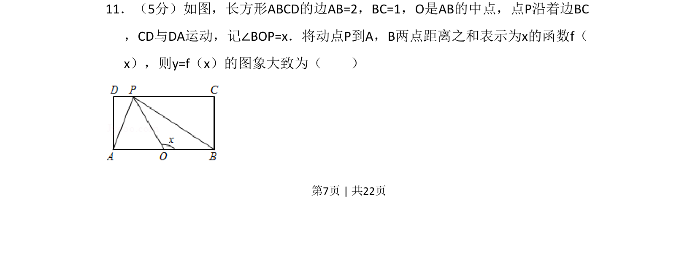

## 题面

## 摘要

动点P沿长方形边界运动，将PA+PB表示为角度x的函数，判断函数图象形状。

## 关联考点

- [[187-函数图象|函数图象]]
- [[290-分段函数|分段函数]]
- [[动点轨迹]]
- [[距离公式]]

## 答案与解析

> 📄 原 PDF 第 7 页：`素材/真题/吉林/2008-2024·（吉林）数学高考真题/2015年高考数学试卷（文）（新课标Ⅱ）（解析卷）.pdf`
