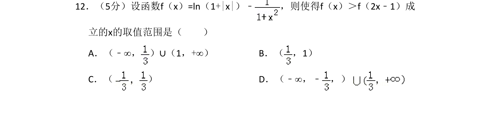
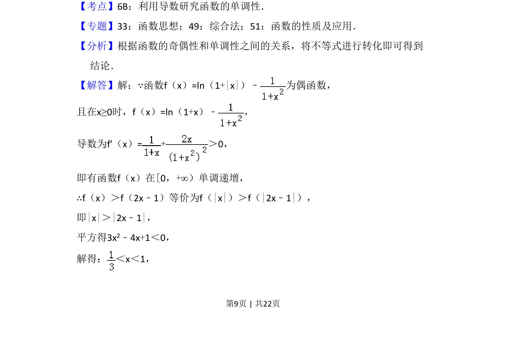
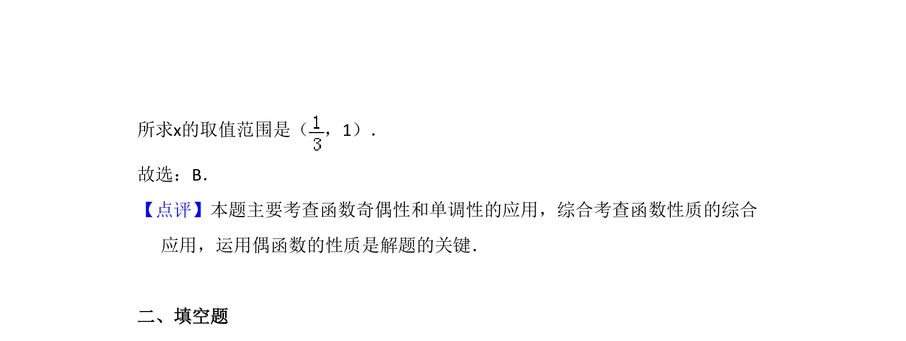

## 题面

## 摘要

本题考查利用函数的奇偶性与单调性解抽象不等式，通过导数判断单调性并转化绝对值不等式求解。

## 关联考点

- [[284-函数的奇偶性|函数的奇偶性]]
- [[705-利用导数研究函数的单调性|利用导数研究函数的单调性]]
- [[1092-绝对值不等式|绝对值不等式]]

## 答案与解析

> 📄 原 PDF 第 9 页：`素材/真题/吉林/2008-2024·（吉林）数学高考真题/2015年高考数学试卷（文）（新课标Ⅱ）（解析卷）.pdf`

<!-- 题干文本-start -->
## 题干文本
12．（5分）设函数f（x）=ln（1+|x|）﹣ ，则使得f（x）＞f（2x﹣1）成
立的x的取值范围是（　　）
A．（﹣∞， ）∪（1，+∞）B．（ ，1）
C．（ ）D．（﹣∞，﹣ ，）
<!-- 题干文本-end -->

<!-- 解析文本-start -->
## 解析文本
【考点】6B：利用导数研究函数的单调性．菁优网版权所有
【专题】33：函数思想；49：综合法；51：函数的性质及应用．
【分析】根据函数的奇偶性和单调性之间的关系，将不等式进行转化即可得到
结论．
【解答】解：∵函数f（x）=ln（1+|x|）﹣ 为偶函数，
且在x≥0时，f（x）=ln（1+x）﹣ ，
导数为f′（x）=+＞0，
即有函数f（x）在[0，+∞）单调递增，
∴f（x）＞f（2x﹣1）等价为f（|x|）＞f（|2x﹣1|），
即|x|＞|2x﹣1|，
平方得3x2﹣4x+1＜0，
解得： ＜x＜1，
<!-- 解析文本-end -->
