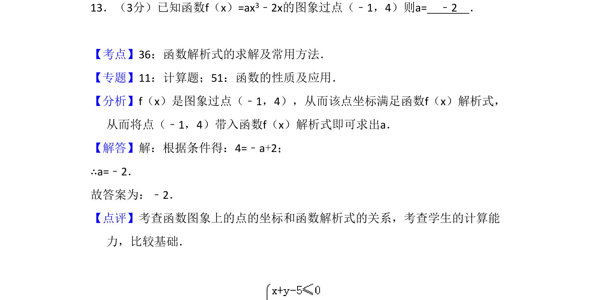
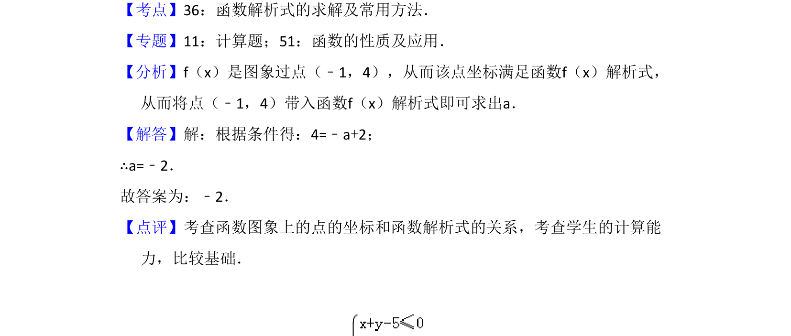

## 题面

## 摘要

已知函数图象过点求参数值，利用点坐标满足函数解析式建立方程求解。

## 关联考点

- [[693-函数解析式|函数解析式]]
- [[977-点与函数图象的关系|点与函数图象的关系]]
- [[649-代数运算|代数运算]]

## 答案与解析

> 📄 原 PDF 第 10 页：`素材/真题/吉林/2008-2024·（吉林）数学高考真题/2015年高考数学试卷（文）（新课标Ⅱ）（解析卷）.pdf`
