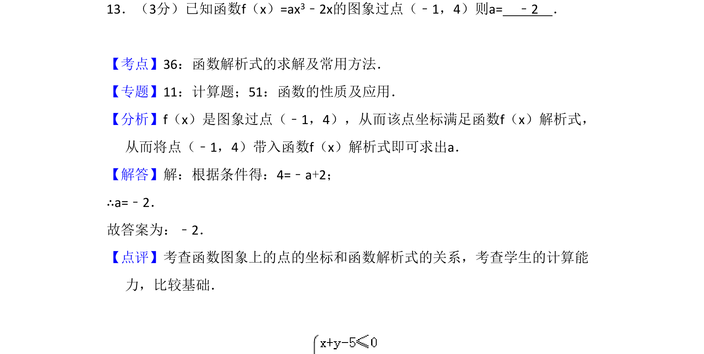
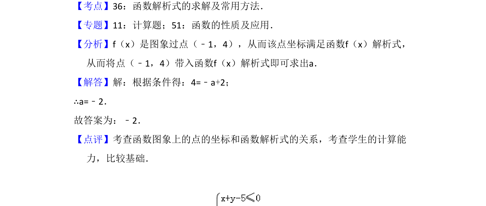

## 题面

## 摘要

已知函数图象过点求参数值，利用点坐标满足函数解析式建立方程求解。

## 关联考点

- [[693-函数解析式|函数解析式]]
- [[976-点与函数图象的关系|点与函数图象的关系]]
- [[649-代数运算|代数运算]]

## 答案与解析

> 📄 原 PDF 第 10 页：`素材/真题/吉林/2008-2024·（吉林）数学高考真题/2015年高考数学试卷（文）（新课标Ⅱ）（解析卷）.pdf`

<!-- 题干文本-start -->
## 题干文本
13．（3分）已知函数f（x）=ax3﹣2x的图象过点（﹣1，4）则a=　﹣2　．
<!-- 题干文本-end -->

<!-- 解析文本-start -->
## 解析文本
【考点】36：函数解析式的求解及常用方法．菁优网版权所有
【专题】11：计算题；51：函数的性质及应用．
【分析】f（x）是图象过点（﹣1，4），从而该点坐标满足函数f（x）解析式，
从而将点（﹣1，4）带入函数f（x）解析式即可求出a．
【解答】解：根据条件得：4=﹣a+2；
∴a=﹣2．
故答案为：﹣2．
【点评】考查函数图象上的点的坐标和函数解析式的关系，考查学生的计算能
力，比较基础．
<!-- 解析文本-end -->
