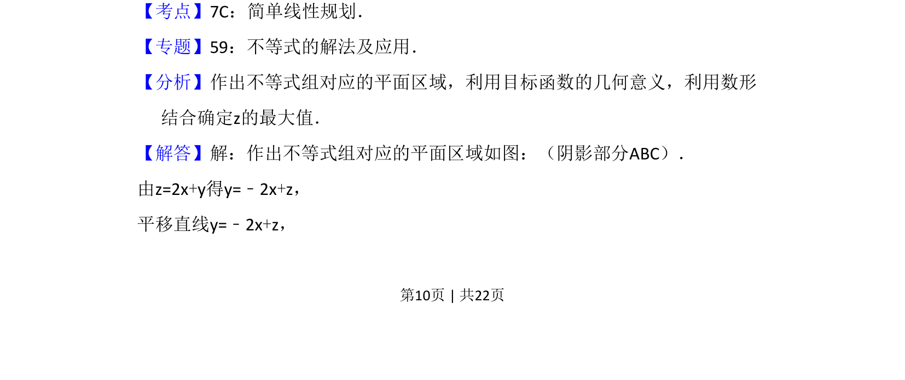
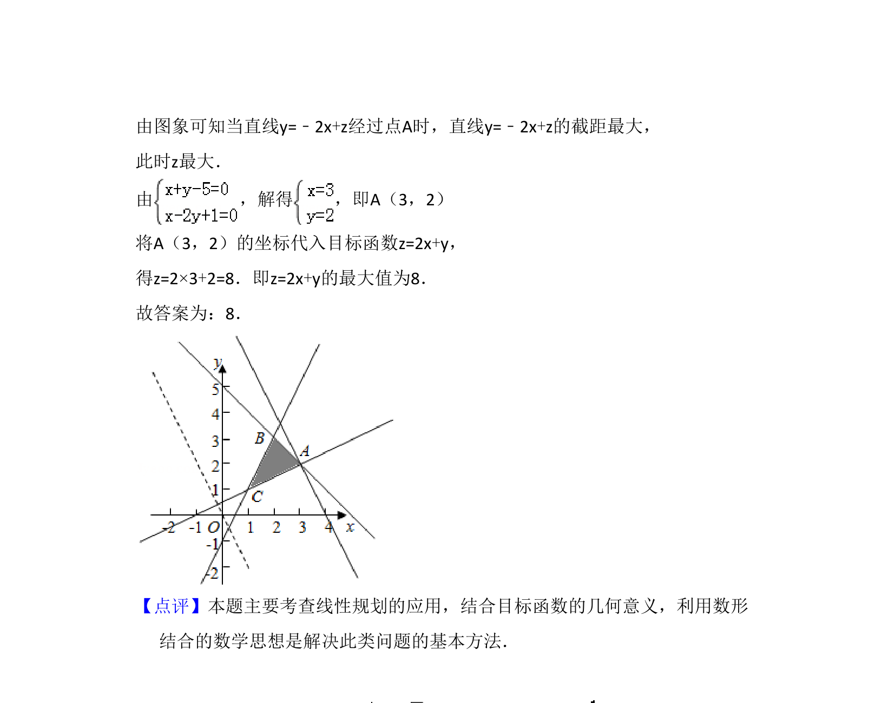

## 题面

## 摘要

本题考查二元一次不等式组表示的平面区域及线性目标函数的最值问题，通过数形结合求最大值。

## 关联考点

- [[简单线性规划]]
- [[目标函数最值]]
- [[可行域]]
- [[数形结合]]

## 答案与解析

> 📄 原 PDF 第 10 页：`素材/真题/吉林/2008-2024·（吉林）数学高考真题/2015年高考数学试卷（文）（新课标Ⅱ）（解析卷）.pdf`
