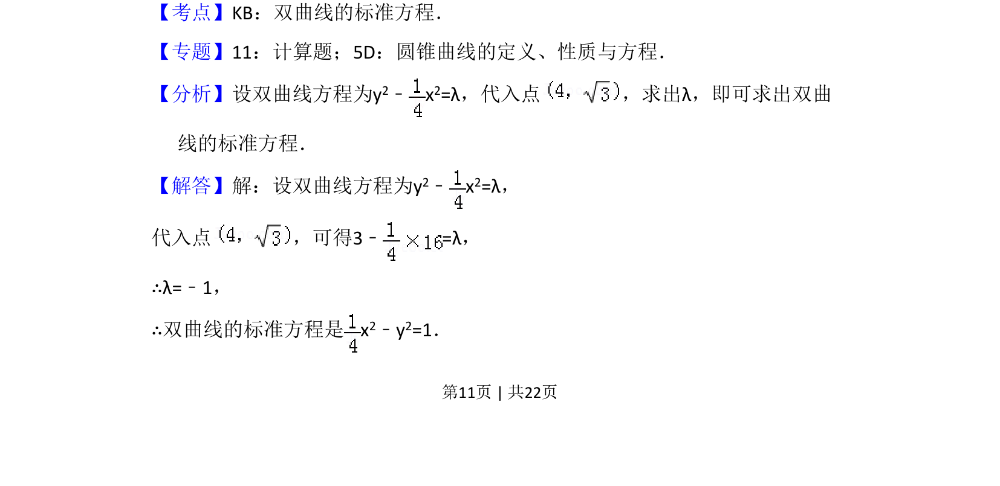
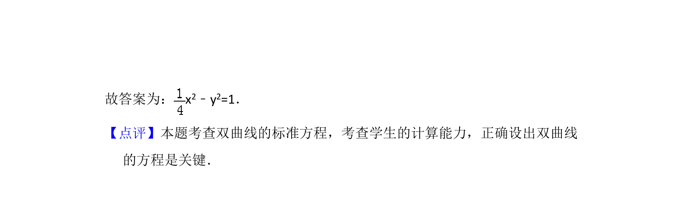

## 题面

## 摘要

双曲线通过渐近线设方程并代入点求标准方程

## 关联考点

- [[732-双曲线的标准方程|双曲线的标准方程]]
- [[369-双曲线渐近线|渐近线]]
- [[197-待定系数法|待定系数法]]

## 答案与解析

> 📄 原 PDF 第 11 页：`素材/真题/吉林/2008-2024·（吉林）数学高考真题/2015年高考数学试卷（文）（新课标Ⅱ）（解析卷）.pdf`
