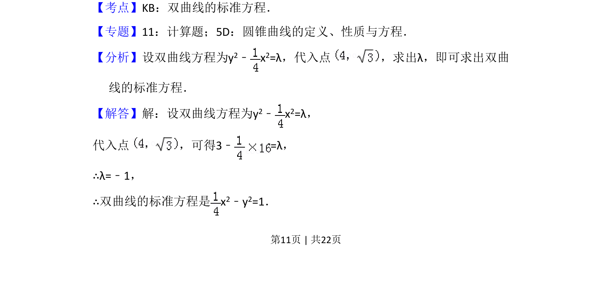
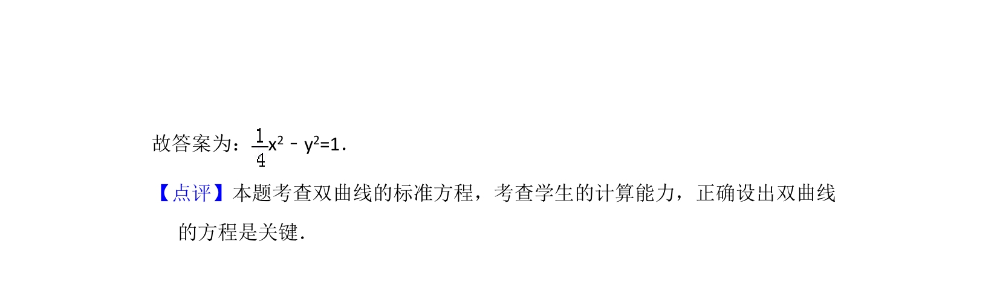

## 题面

## 摘要

双曲线通过渐近线设方程并代入点求标准方程

## 关联考点

- [[732-双曲线的标准方程|双曲线的标准方程]]
- [[369-双曲线渐近线|渐近线]]
- [[197-待定系数法|待定系数法]]

## 答案与解析

> 📄 原 PDF 第 11 页：`素材/真题/吉林/2008-2024·（吉林）数学高考真题/2015年高考数学试卷（文）（新课标Ⅱ）（解析卷）.pdf`

<!-- 题干文本-start -->
## 题干文本
15．（3分）已知双曲线过点 且渐近线方程为y=±x，则该双曲线的标
准方程是　 x2﹣y2=1　．
<!-- 题干文本-end -->

<!-- 解析文本-start -->
## 解析文本
【考点】KB：双曲线的标准方程．菁优网版权所有
【专题】11：计算题；5D：圆锥曲线的定义、性质与方程．
【分析】设双曲线方程为y2﹣x 2=λ，代入点 ，求出λ，即可求出双曲
线的标准方程．
【解答】解：设双曲线方程为y2﹣x 2=λ，
代入点 ，可得3﹣=λ，
∴λ=﹣1，
∴双曲线的标准方程是x 2﹣y2=1．
<!-- 解析文本-end -->
