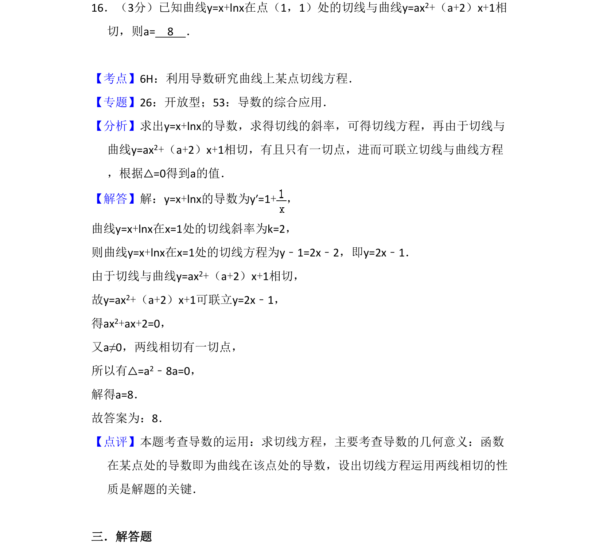
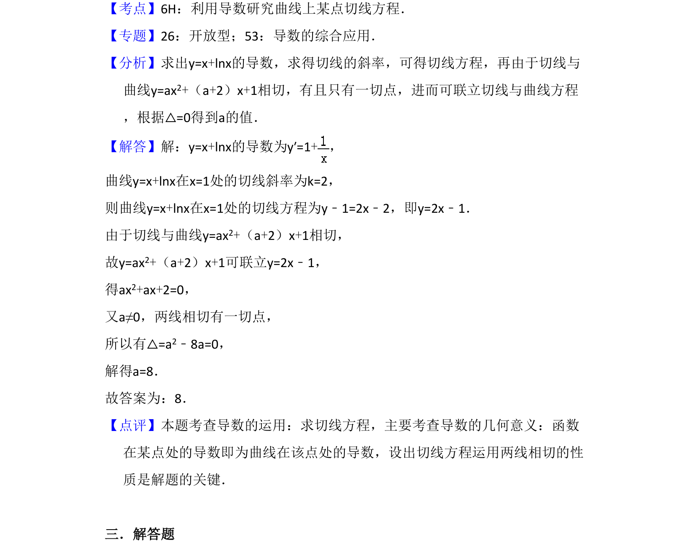

## 题面

## 摘要

求曲线切线方程，利用导数几何意义及判别式求解参数值

## 关联考点

- [[840-导数几何意义|导数几何意义]]
- [[422-切线方程|切线方程]]
- [[229-根的判别式|判别式]]
- [[1037-相切条件|相切条件]]

## 答案与解析

> 📄 原 PDF 第 12 页：`素材/真题/吉林/2008-2024·（吉林）数学高考真题/2015年高考数学试卷（文）（新课标Ⅱ）（解析卷）.pdf`
