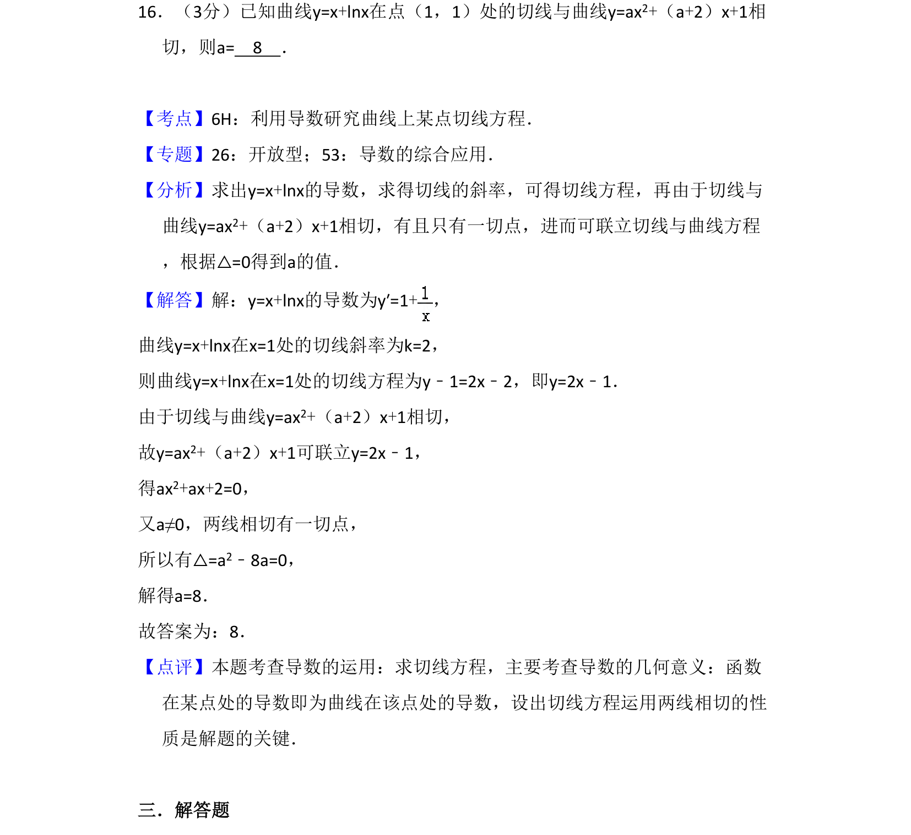
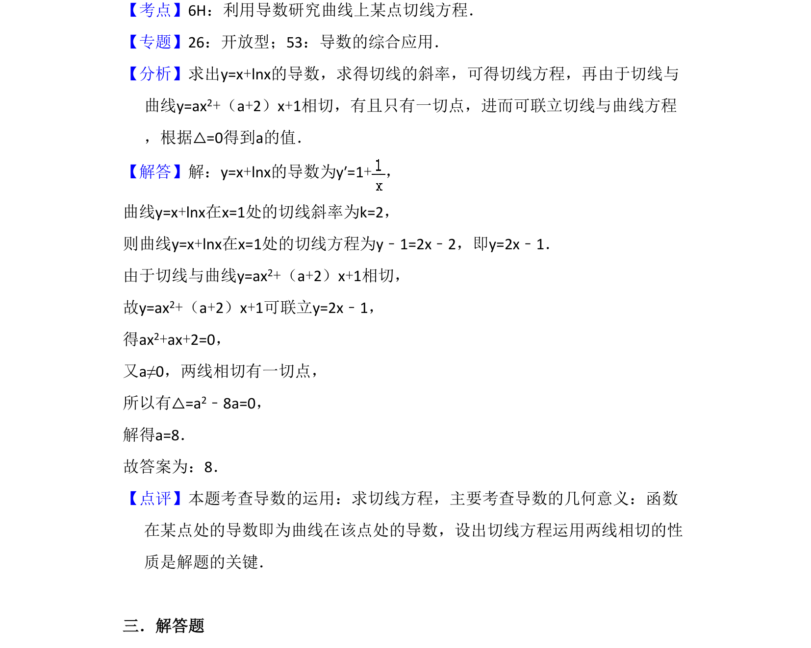

## 题面

## 摘要

求曲线切线方程，利用导数几何意义及判别式求解参数值

## 关联考点

- [[440-导数的几何意义|导数几何意义]]
- [[422-切线方程|切线方程]]
- [[229-根的判别式|判别式]]
- [[1036-相切条件|相切条件]]

## 答案与解析

> 📄 原 PDF 第 12 页：`素材/真题/吉林/2008-2024·（吉林）数学高考真题/2015年高考数学试卷（文）（新课标Ⅱ）（解析卷）.pdf`

<!-- 题干文本-start -->
## 题干文本
16．（3分）已知曲线y=x+lnx在点（1，1）处的切线与曲线y=ax2+（a+2）x+1相
切，则a=　8　．
<!-- 题干文本-end -->

<!-- 解析文本-start -->
## 解析文本
【考点】6H：利用导数研究曲线上某点切线方程．菁优网版权所有
【专题】26：开放型；53：导数的综合应用．
【分析】求出y=x+lnx的导数，求得切线的斜率，可得切线方程，再由于切线与
曲线y=ax2+（a+2）x+1相切，有且只有一切点，进而可联立切线与曲线方程
，根据△=0得到a的值．
【解答】解：y=x+lnx的导数为y′=1+，
曲线y=x+lnx在x=1处的切线斜率为k=2，
则曲线y=x+lnx在x=1处的切线方程为y﹣1=2x﹣2，即y=2x﹣1．
由于切线与曲线y=ax2+（a+2）x+1相切，
故y=ax2+（a+2）x+1可联立y=2x﹣1，
得ax2+ax+2=0，
又a≠0，两线相切有一切点，
所以有△=a2﹣8a=0，
解得a=8．
故答案为：8．
【点评】本题考查导数的运用：求切线方程，主要考查导数的几何意义：函数
在某点处的导数即为曲线在该点处的导数，设出切线方程运用两线相切的性
质是解题的关键．
　
三．解答题
<!-- 解析文本-end -->
