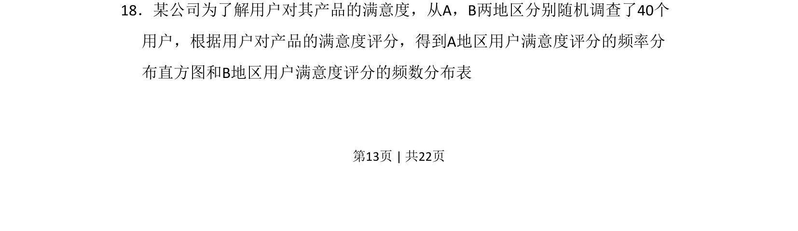
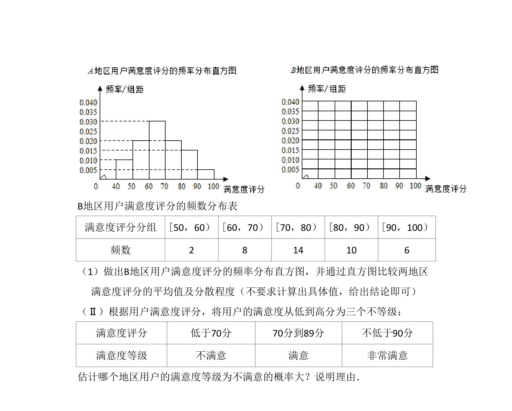
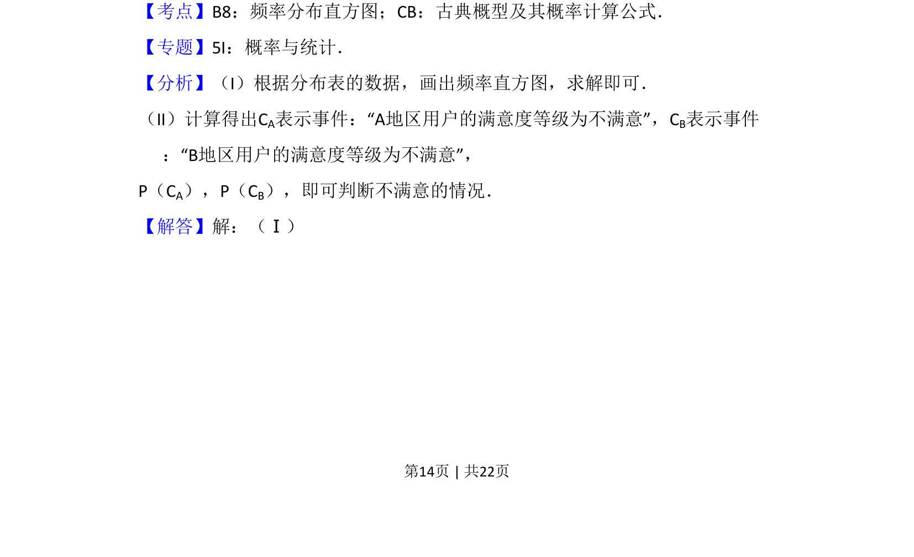
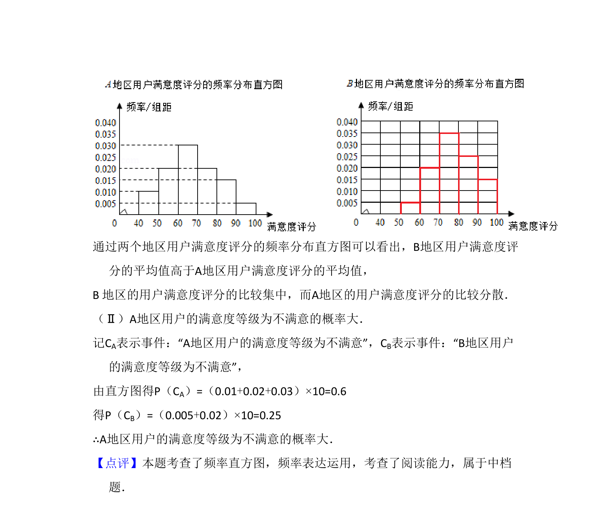

## 题面

## 摘要

根据频率分布直方图和频数分布表分析用户满意度数据，考查统计图表的理解与基本数据处理。

## 关联考点

- [[364-频率分布直方图|频率分布直方图]]
- [[1153-频数分布表|频数分布表]]
- [[586-统计估计|统计估计]]

## 答案与解析

> 📄 原 PDF 第 13 页：`素材/真题/吉林/2008-2024·（吉林）数学高考真题/2015年高考数学试卷（文）（新课标Ⅱ）（解析卷）.pdf`
