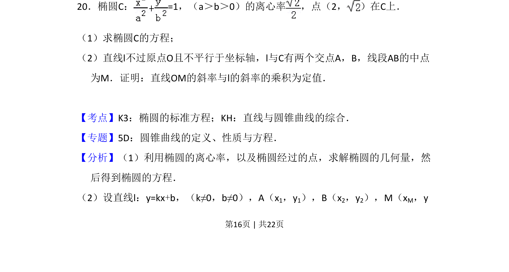
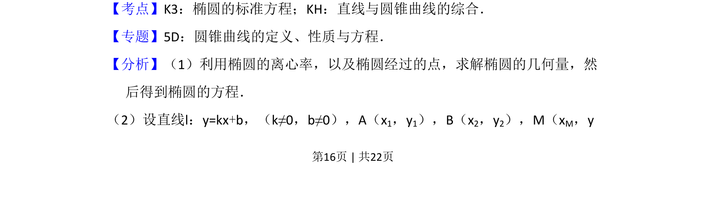
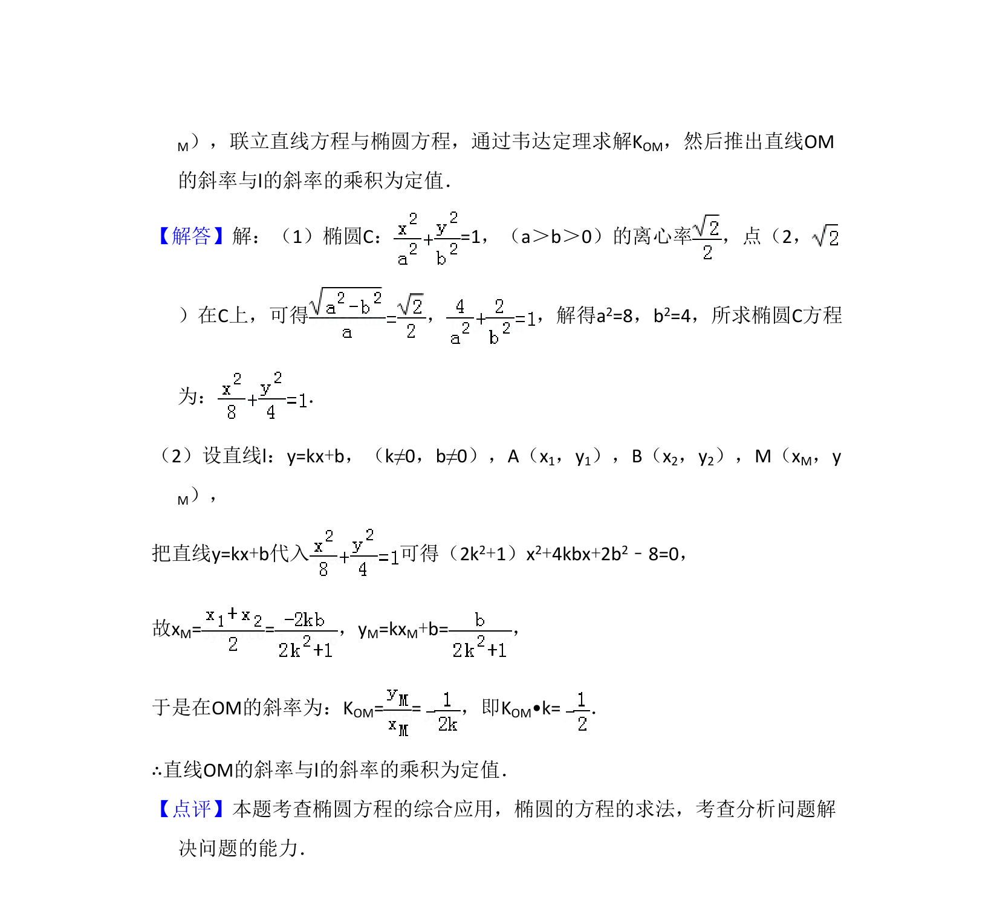

## 题面

## 摘要

已知椭圆离心率和一点求标准方程，并证明中点弦斜率乘积为定值

## 关联考点

- [[061-方程|椭圆的标准方程]]
- [[015-位置|直线与椭圆的位置关系]]
- [[1214-中点弦|中点弦]]
- [[377-定点定值问题|定值问题]]

## 答案与解析

> 📄 原 PDF 第 16 页：`素材/真题/吉林/2008-2024·（吉林）数学高考真题/2015年高考数学试卷（文）（新课标Ⅱ）（解析卷）.pdf`
