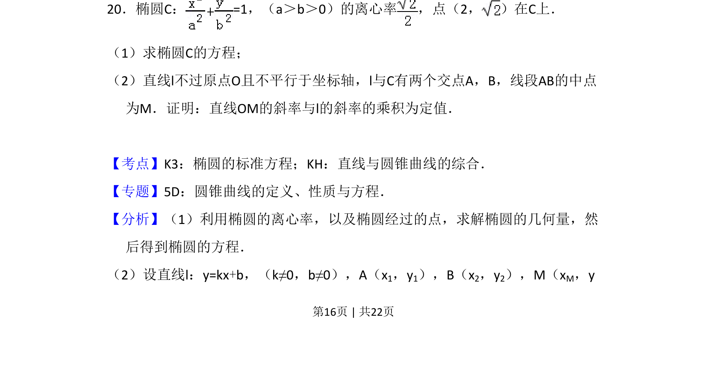
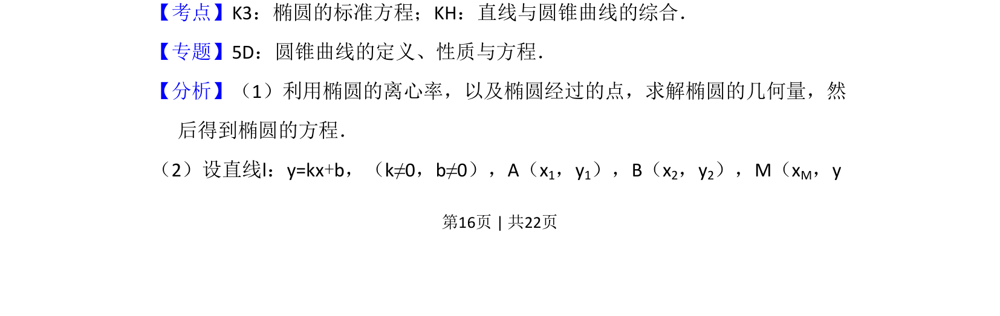
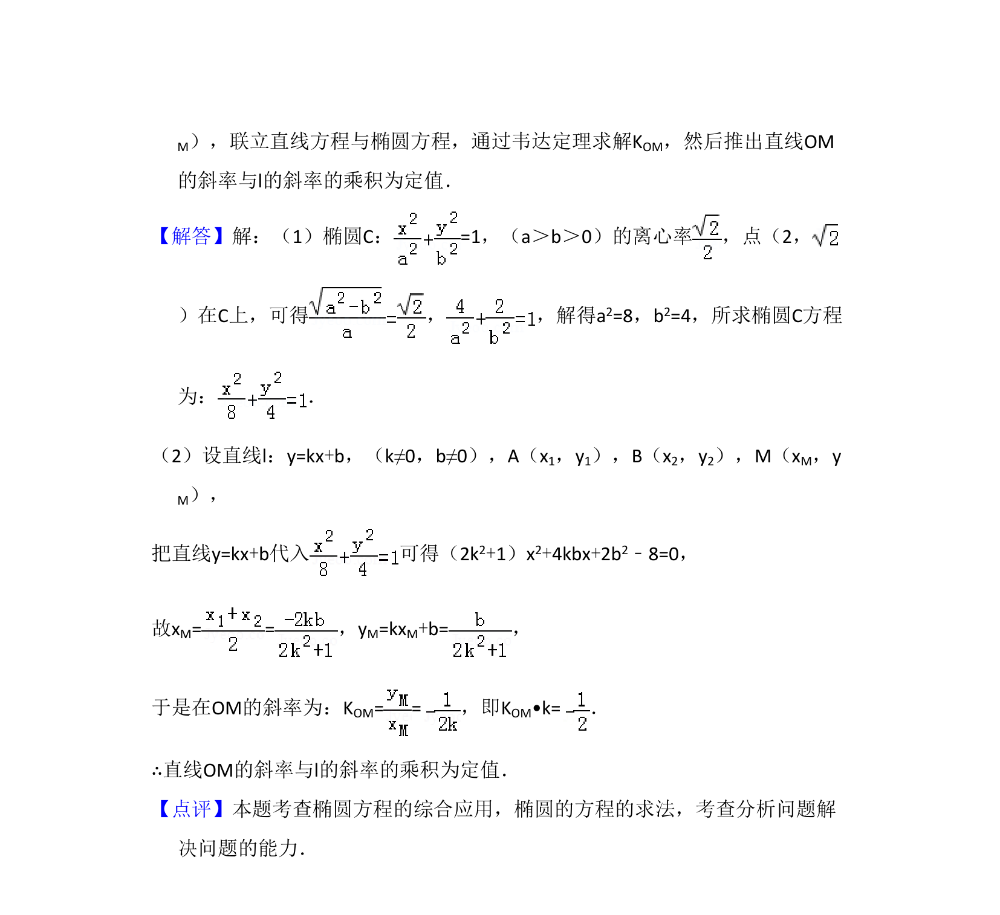

## 题面

## 摘要

已知椭圆离心率和一点求标准方程，并证明中点弦斜率乘积为定值

## 关联考点

- [[061-方程|椭圆的标准方程]]
- [[015-位置|直线与椭圆的位置关系]]
- [[1213-中点弦|中点弦]]
- [[377-定点定值问题|定值问题]]

## 答案与解析

> 📄 原 PDF 第 16 页：`素材/真题/吉林/2008-2024·（吉林）数学高考真题/2015年高考数学试卷（文）（新课标Ⅱ）（解析卷）.pdf`

<!-- 题干文本-start -->
## 题干文本
20．椭圆C：=1，（a＞b＞0）的离心率 ，点（2， ）在C上．
（1）求椭圆C的方程；
（2）直线l不过原点O且不平行于坐标轴，l与C有两个交点A，B，线段AB的中点
为M．证明：直线OM的斜率与l的斜率的乘积为定值．
<!-- 题干文本-end -->

<!-- 解析文本-start -->
## 解析文本
【考点】K3：椭圆的标准方程；KH：直线与圆锥曲线的综合．菁优网版权所有
【专题】5D：圆锥曲线的定义、性质与方程．
【分析】（1）利用椭圆的离心率，以及椭圆经过的点，求解椭圆的几何量，然
后得到椭圆的方程．
（2）设直线l：y=kx+b，（k≠0，b≠0），A（x1，y1），B（x2，y2），M（xM，y
<!-- 解析文本-end -->
