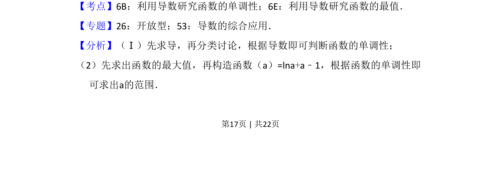
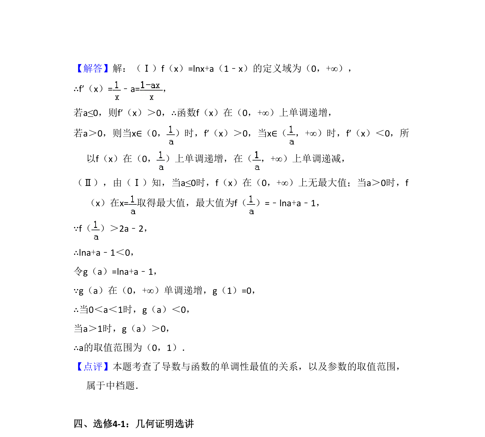

## 题面

## 摘要

本题主要考查含参对数函数的单调性讨论及已知最值条件求参数取值范围，涉及分类讨论与构造函数思想。

## 关联考点

- [[705-利用导数研究函数的单调性|利用导数研究函数的单调性]]
- [[706-利用导数研究函数的最值|利用导数研究函数的最值]]
- [[924-构造函数解不等式|构造函数解不等式]]

## 答案与解析

> 📄 原 PDF 第 17 页：`素材/真题/吉林/2008-2024·（吉林）数学高考真题/2015年高考数学试卷（文）（新课标Ⅱ）（解析卷）.pdf`
