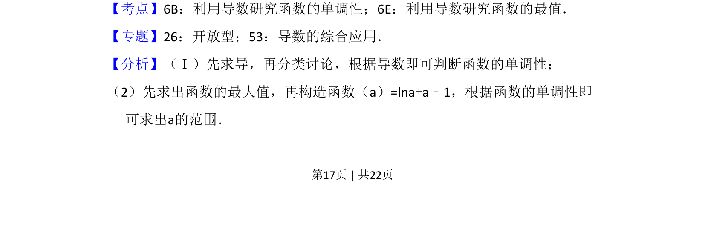
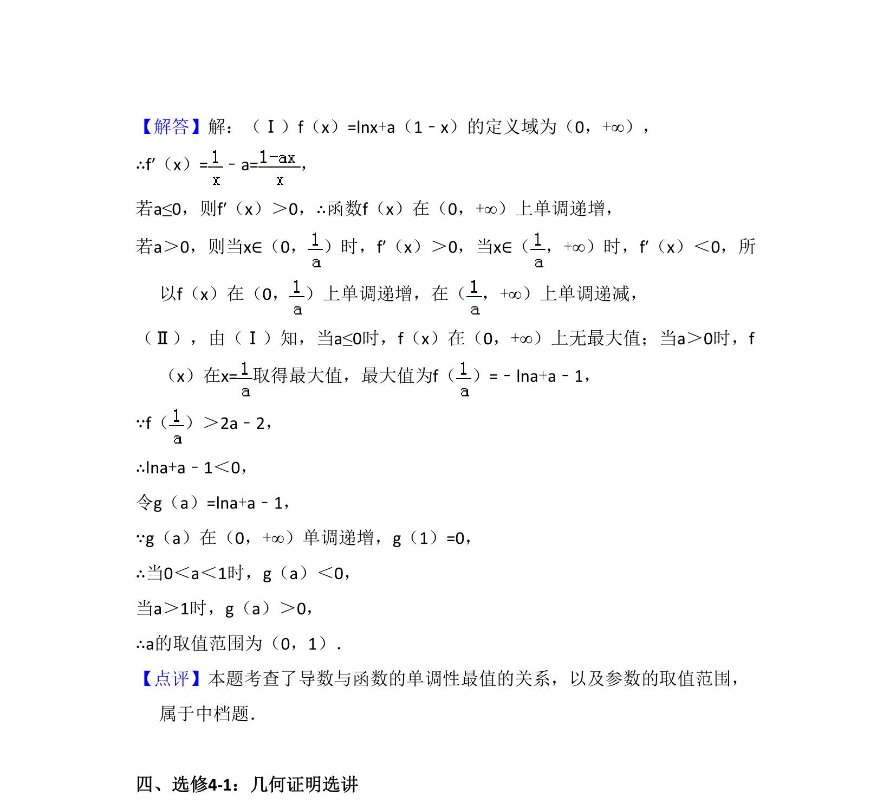

## 题面

## 摘要

本题主要考查含参对数函数的单调性讨论及已知最值条件求参数取值范围，涉及分类讨论与构造函数思想。

## 关联考点

- [[705-利用导数研究函数的单调性|利用导数研究函数的单调性]]
- [[706-利用导数研究函数的最值|利用导数研究函数的最值]]
- [[924-构造函数解不等式|构造函数解不等式]]

## 答案与解析

> 📄 原 PDF 第 17 页：`素材/真题/吉林/2008-2024·（吉林）数学高考真题/2015年高考数学试卷（文）（新课标Ⅱ）（解析卷）.pdf`

<!-- 题干文本-start -->
## 题干文本
21．设函数f（x）=lnx+a（1﹣x）．
（Ⅰ）讨论：f（x）的单调性；
（Ⅱ）当f（x）有最大值，且最大值大于2a﹣2时，求a的取值范围．
<!-- 题干文本-end -->

<!-- 解析文本-start -->
## 解析文本
【考点】6B：利用导数研究函数的单调性；6E：利用导数研究函数的最值．菁优网版权所有
【专题】26：开放型；53：导数的综合应用．
【分析】（Ⅰ）先求导，再分类讨论，根据导数即可判断函数的单调性；
（2）先求出函数的最大值，再构造函数（a）=lna+a﹣1，根据函数的单调性即
可求出a的范围．
<!-- 解析文本-end -->
