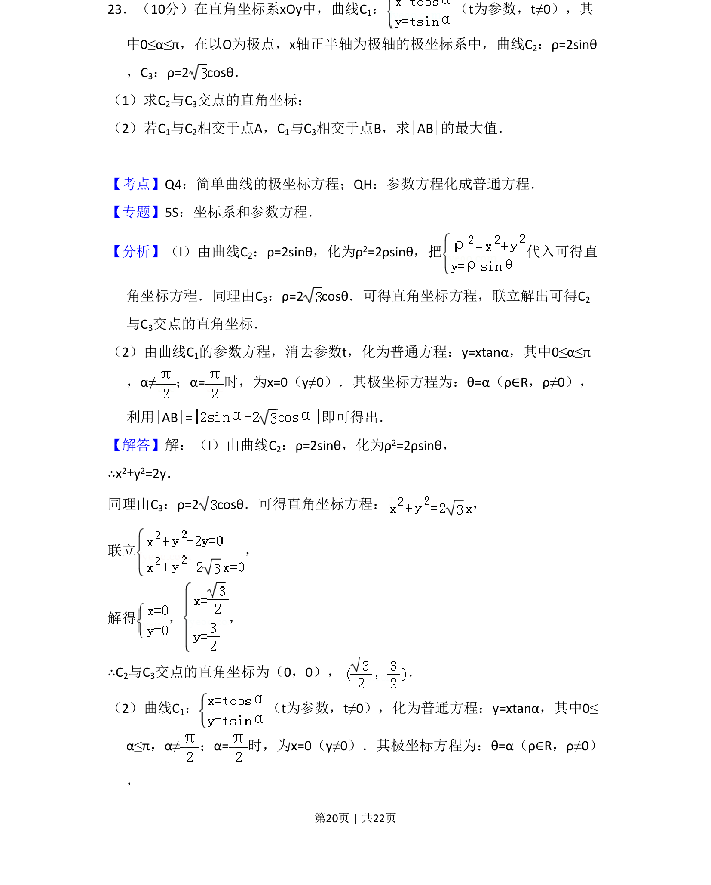
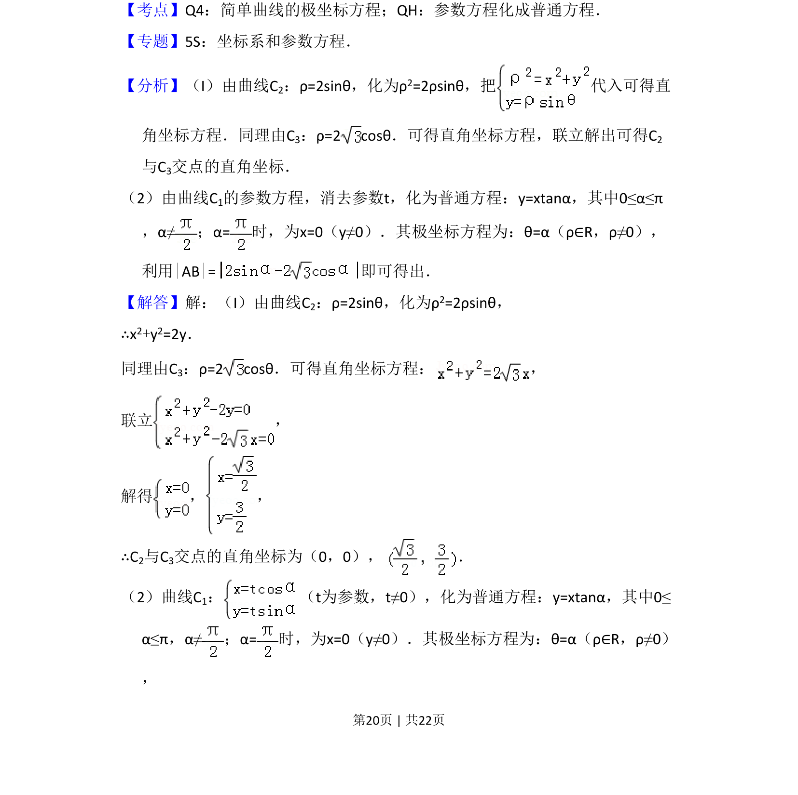
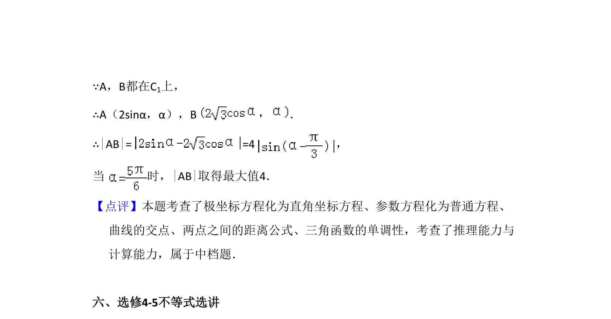

## 题面

## 摘要

本题主要考查极坐标方程与直角坐标方程的互化、参数方程与普通方程的转化，以及利用极坐标求曲线交点与距离最大值。

## 关联考点

- [[562-极坐标方程化直角坐标方程|极坐标方程化直角坐标方程]]
- [[723-参数方程化普通方程|参数方程化普通方程]]
- [[626-两点间距离公式|两点间距离公式]]

## 答案与解析

> 📄 原 PDF 第 20 页：`素材/真题/吉林/2008-2024·（吉林）数学高考真题/2015年高考数学试卷（文）（新课标Ⅱ）（解析卷）.pdf`
