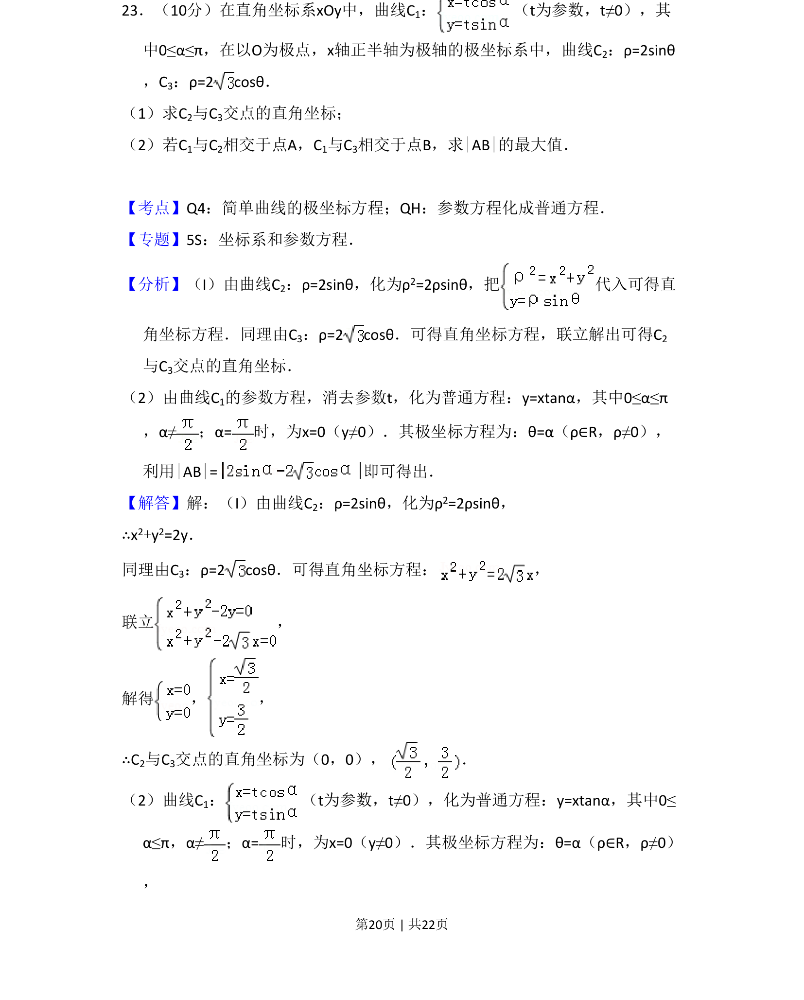
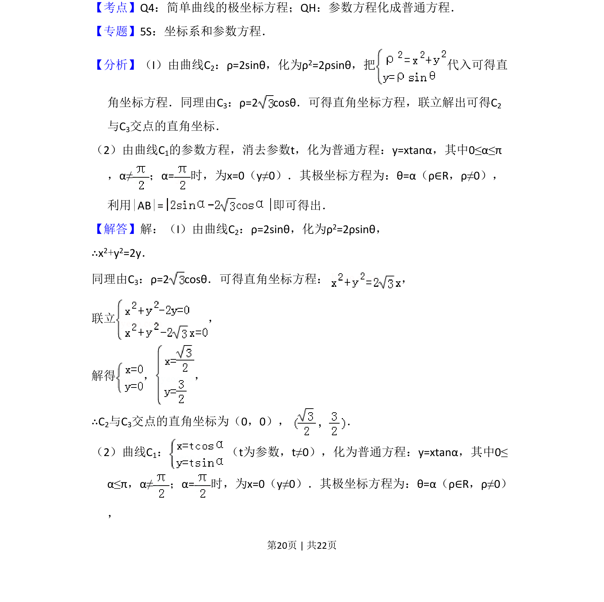
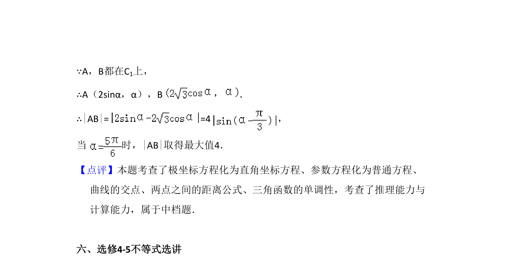

## 题面

## 摘要

本题主要考查极坐标方程与直角坐标方程的互化、参数方程与普通方程的转化，以及利用极坐标求曲线交点与距离最大值。

## 关联考点

- [[562-极坐标方程化直角坐标方程|极坐标方程化直角坐标方程]]
- [[723-参数方程化普通方程|参数方程化普通方程]]
- [[626-两点间距离公式|两点间距离公式]]

## 答案与解析

> 📄 原 PDF 第 20 页：`素材/真题/吉林/2008-2024·（吉林）数学高考真题/2015年高考数学试卷（文）（新课标Ⅱ）（解析卷）.pdf`

<!-- 题干文本-start -->
## 题干文本
23．（10分）在直角坐标系xOy中，曲线C1： （t为参数，t≠0），其
中0≤α≤π，在以O为极点，x轴正半轴为极轴的极坐标系中，曲线C2：ρ=2sinθ
，C3：ρ=2 cosθ．
（1）求C2与C3交点的直角坐标；
（2）若C1与C2相交于点A，C1与C3相交于点B，求|AB|的最大值．
<!-- 题干文本-end -->

<!-- 解析文本-start -->
## 解析文本
【考点】Q4：简单曲线的极坐标方程；QH：参数方程化成普通方程．菁优网版权所有
【专题】5S：坐标系和参数方程．
【分析】（I）由曲线C2：ρ=2sinθ，化为ρ2=2ρsinθ，把 代入可得直
角坐标方程．同理由C3：ρ=2 cosθ．可得直角坐标方程，联立解出可得C 2
与C3交点的直角坐标．
（2）由曲线C1的参数方程，消去参数t，化为普通方程：y=xtanα，其中0≤α≤π
，α≠；α=时，为x=0（y≠0）．其极坐标方程为：θ=α（ρ∈R，ρ≠0），
利用|AB|=即可得出．
【解答】解：（I）由曲线C2：ρ=2sinθ，化为ρ2=2ρsinθ，
∴x2+y2=2y．
同理由C3：ρ=2 cosθ．可得直角坐标方程： ，
联立 ，
解得 ， ，
∴C2与C3交点的直角坐标为（0，0）， ．
（2）曲线C1： （t为参数，t≠0），化为普通方程：y=xtanα，其中0≤
α≤π，α≠；α=时，为x=0（y≠0）．其极坐标方程为：θ=α（ρ∈R，ρ≠0）
，
<!-- 解析文本-end -->
