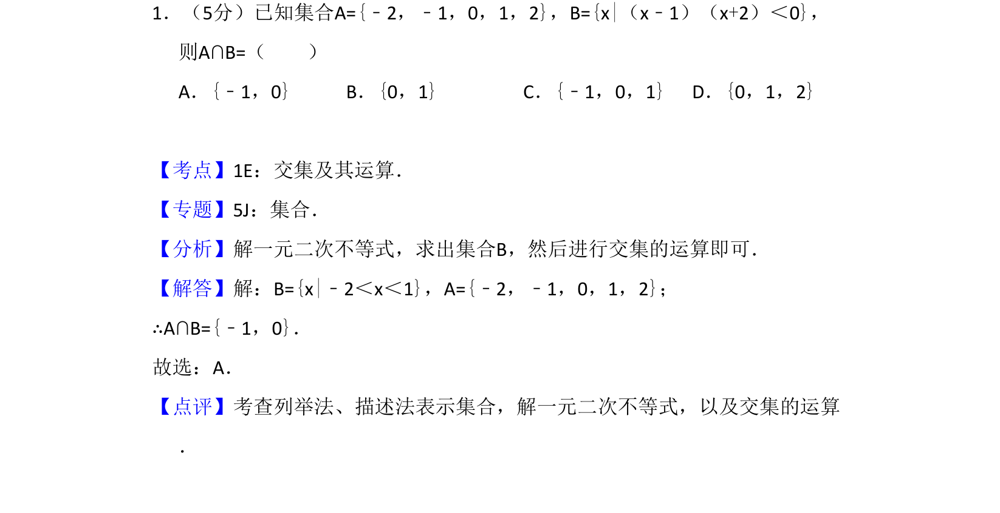
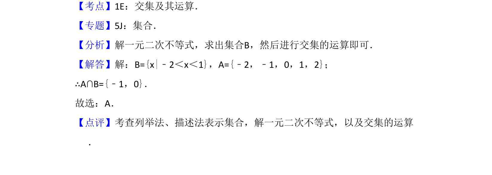

## 题面

## 摘要

该题主要考查集合的交集运算及一元二次不等式的解法。

## 关联考点

- [[042-集合|集合]]
- [[1222-交集|交集]]
- [[267-一元二次不等式|一元二次不等式]]

## 答案与解析

> 📄 原 PDF 第 1 页：`素材/真题/吉林/2008-2024·（吉林）数学高考真题/2015年高考数学试卷（理）（新课标Ⅱ）（解析卷）.pdf`

<!-- 题干文本-start -->
## 题干文本
1．（5分）已知集合A={﹣2，﹣1，0，1，2}，B={x|（x﹣1）（x+2）＜0}，
则A∩B=（　　）
A．{﹣1，0}B．{0，1}C．{﹣1，0，1}D．{0，1，2}
<!-- 题干文本-end -->

<!-- 解析文本-start -->
## 解析文本
【考点】1E：交集及其运算．菁优网版权所有
【专题】5J：集合．
【分析】解一元二次不等式，求出集合B，然后进行交集的运算即可．
【解答】解：B={x|﹣2＜x＜1}，A={﹣2，﹣1，0，1，2}；
∴A∩B={﹣1，0}．
故选：A．
【点评】考查列举法、描述法表示集合，解一元二次不等式，以及交集的运算
．
<!-- 解析文本-end -->
