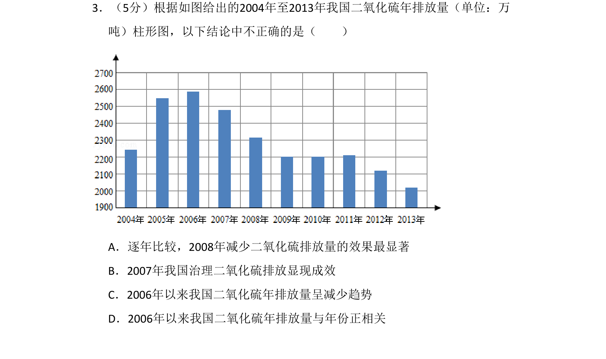
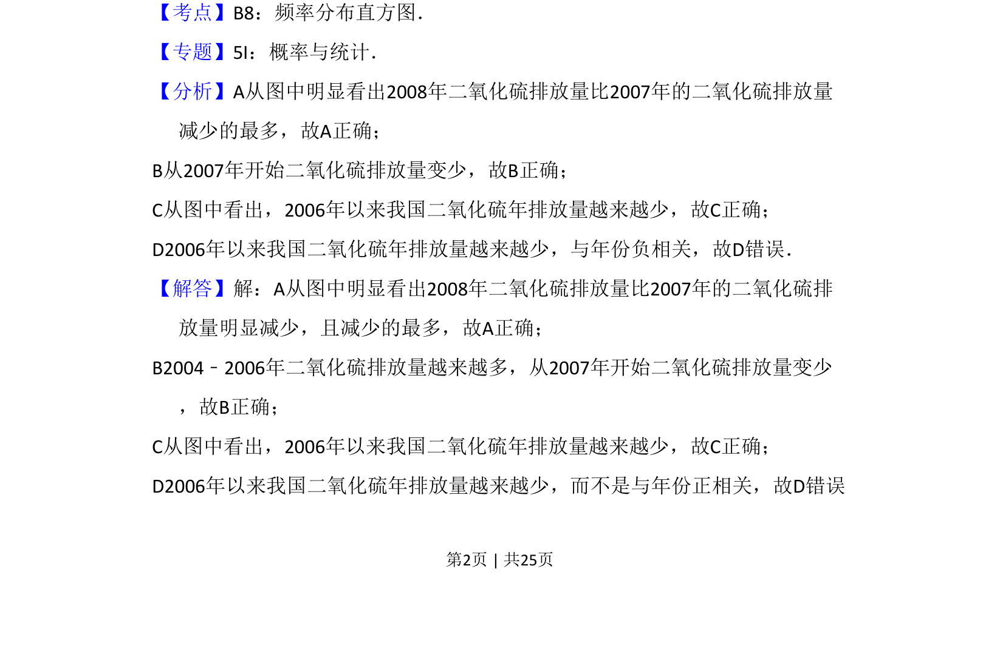
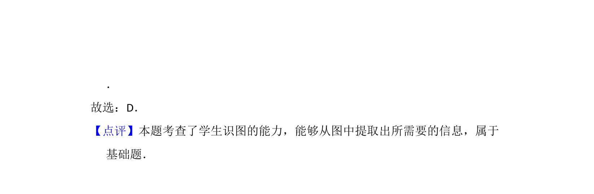

## 题面

## 摘要

根据2004-2013年我国二氧化硫年排放量柱形图，判断四个统计结论中不正确的一项。

## 关联考点

- [[141-统计图|统计]]
- [[563-柱形图|柱形图]]
- [[899-数据分析|数据分析]]

## 答案与解析

> 📄 原 PDF 第 2 页：`素材/真题/吉林/2008-2024·（吉林）数学高考真题/2015年高考数学试卷（理）（新课标Ⅱ）（解析卷）.pdf`
