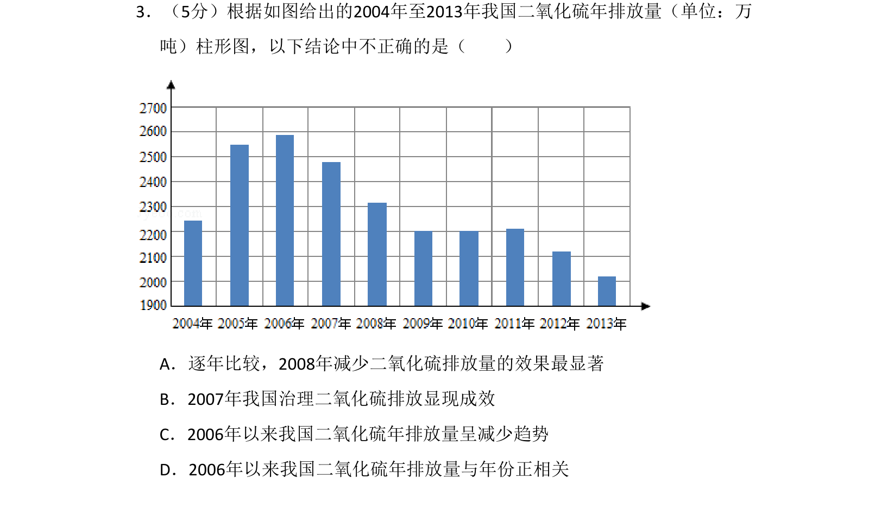
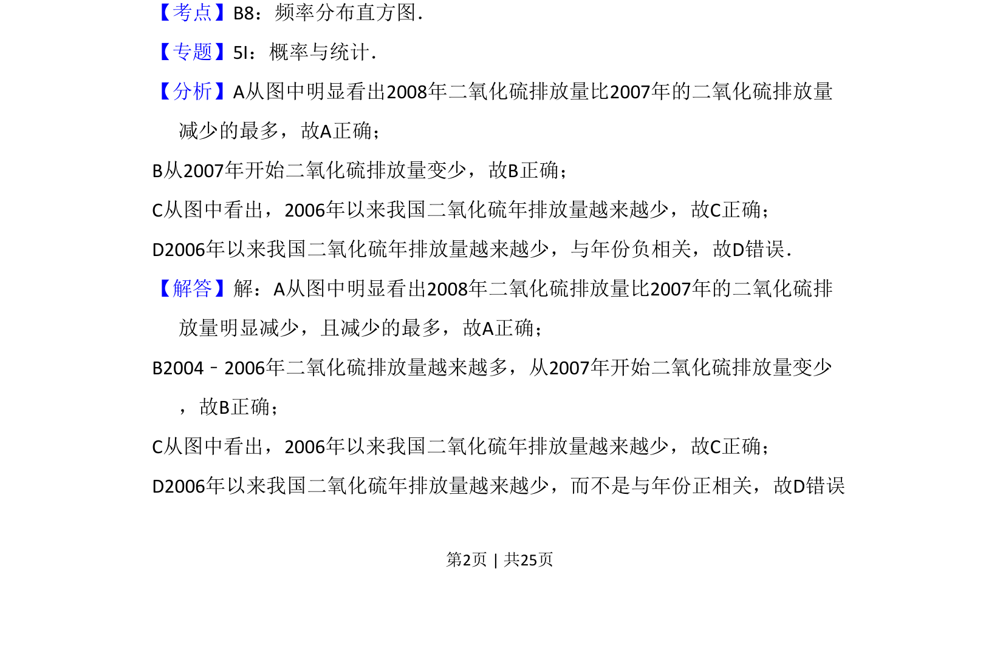
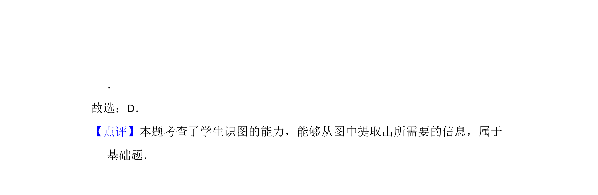

## 题面

## 摘要

根据2004-2013年我国二氧化硫年排放量柱形图，判断四个统计结论中不正确的一项。

## 关联考点

- [[141-统计图|统计]]
- [[563-柱形图|柱形图]]
- [[899-数据分析|数据分析]]

## 答案与解析

> 📄 原 PDF 第 2 页：`素材/真题/吉林/2008-2024·（吉林）数学高考真题/2015年高考数学试卷（理）（新课标Ⅱ）（解析卷）.pdf`

<!-- 题干文本-start -->
## 题干文本
3．（5分）根据如图给出的2004年至2013年我国二氧化硫年排放量（单位：万
吨）柱形图，以下结论中不正确的是（　　）
A．逐年比较，2008年减少二氧化硫排放量的效果最显著
B．2007年我国治理二氧化硫排放显现成效
C．2006年以来我国二氧化硫年排放量呈减少趋势
D．2006年以来我国二氧化硫年排放量与年份正相关
<!-- 题干文本-end -->

<!-- 解析文本-start -->
## 解析文本
【考点】B8：频率分布直方图．菁优网版权所有
【专题】5I：概率与统计．
【分析】A从图中明显看出2008年二氧化硫排放量比2007年的二氧化硫排放量
减少的最多，故A正确；
B从2007年开始二氧化硫排放量变少，故B正确；
C从图中看出，2006年以来我国二氧化硫年排放量越来越少，故C正确；
D2006年以来我国二氧化硫年排放量越来越少，与年份负相关，故D错误．
【解答】解：A从图中明显看出2008年二氧化硫排放量比2007年的二氧化硫排
放量明显减少，且减少的最多，故A正确；
B2004﹣2006年二氧化硫排放量越来越多，从2007年开始二氧化硫排放量变少
，故B正确；
C从图中看出，2006年以来我国二氧化硫年排放量越来越少，故C正确；
D2006年以来我国二氧化硫年排放量越来越少，而不是与年份正相关，故D错误
<!-- 解析文本-end -->
